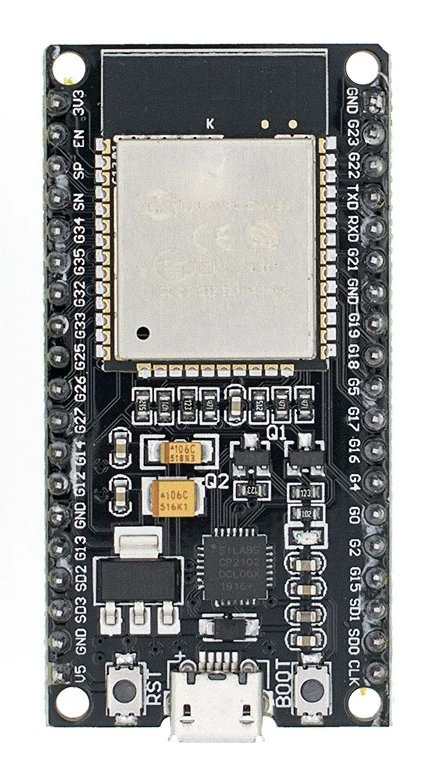

# NODEMCU32 ESP-WROOM-32

## Overview

The NODEMCU32 ESP-WROOM-32 is an open-source firmware development module based on the ESP32 chip. It integrates a
dual-core 32-bit Tensilica Xtensa processor running at up to 240MHz, WiFi, and Bluetooth connectivity. It provides
extensive features and compatibility with various development environments, making it an ideal choice for Internet of
Things (IoT) projects.

## Features

- **SoC:** ESP32-WROOM 32
- **CPU:** Xtensa® single-dual-core 32-bit LX6
- **Clock Frequency:** 80MHz / 240MHz
- **RAM:** 512kB
- **External Flash Memory:** 4MB
- **I/O Pins:** 34
- **ADC Channels:** 18
- **ADC Resolution:** 12-bit
- **DAC Channels:** 2
- **DAC Resolution:** 8-bit
- **Communication Interfaces:** SPI, I2C, I2S, CAN, UART
- **Wi-Fi Protocols:** 802.11 b/g/n (up to 150 Mbps)
- **Wi-Fi Frequency:** 2.4 GHz - 2.5 GHz
- **Bluetooth:** V4.2 - BLE and Classic Bluetooth
- **Wireless Antenna:** PCB
- **Dimensions:** 56x28x13mm (2.2x1.1x0.5in)

## Usage

The module can be powered through the micro USB port with 5V or through the 3.3V pin with caution. Using 5V on the 3.3V
pin may damage the module. It features the CP2102 USB to UART controller for USB-Serial communication.

It can be programmed using various software, programming languages, frameworks, libraries, and examples, including
Espressif IoT Development Framework (ESP-IDF), Arduino IDE (C++), MicroPython, Lua, and more.

The NODEMCU32 ESP-WROOM-32 is designed for prototyping IoT projects, featuring easy connectivity with sensors and
actuators via WiFi and Bluetooth.

## Technical Specs

|                            |                                  |
|----------------------------|----------------------------------|
| Power Supply Voltage (USB) | 5V DC                            |
| Input/Output Voltage       | 3.3V DC                          |
| Operating Current (min.)   | 500mA                            |
| Clock Frequency Range      | 80MHz / 240MHz                   |
| RAM                        | 512kB                            |
| External Flash Memory      | 4MB                              |
| I/O Pins                   | 34                               |
| ADC Channels               | 18                               |
| ADC Resolution             | 12-bit                           |
| DAC Channels               | 2                                |
| DAC Resolution             | 8-bit                            |
| Communication Interfaces   | SPI, I2C, I2S, CAN, UART         |
| Wi-Fi Protocols            | 802.11 b/g/n (up to 150 Mbps)    |
| Wi-Fi Frequency            | 2.4 GHz - 2.5 GHz                |
| Bluetooth                  | V4.2 - BLE and Classic Bluetooth |
| Wireless Antenna           | PCB                              |
| Dimensions                 | 56x28x13mm (2.2x1.1x0.5in)       |

## Pins description

Just like a normal Arduino board, the ESP32 Dev Kit C V2 has digital
input/output pins (GPIO pins - General Purpose Input/Output pins). These
digital input/outputs operate at 3.3V.

**5V voltage must not be connected to any ESP32 chip pins!**

The pins are not 5V tolerant, applying more than 3.3V on any pin will
destroy the chip.

The GPIO pins 34 to 39 are GPIs – input only pins. These pins do not have
internal pull-ups or pull-down resistors. They cannot be used as outputs, so
use these pins only as inputs: GPIO 34, GPIO 35, GPIO 36, GPIO 39

There is an integrated SPI flash on the ESP-WROOM-32 chip. The pins
GPIO6 to GPIO 11 are exposed in certain ESP32 development boards.
These pins are connected to the integrated SPI flash on the chip and are
not recommended for other uses.

GPIO 6 (SCK/CLK), GPIO 7 (SDO/SD0), GPIO 8 (SDI/SD1), GPIO 9 (SHD/
SD2), GPIO 10 (SWP/SD3), GPIO 11 (CSC/CMD).

## Capacitive Touch sensor pins

The ESP32 has 10 internal capacitive touch sensors. The capacitive touch
pins can also be used to wake up the ESP32 from deep sleep. These
internal touch sensors are connected to these GPIOs: T0 (GPIO 4), T1
(GPIO 0), T2 (GPIO 2), T3 (GPIO 15), T4 (GPIO 13), T5(GPIO 12), T6
(GPIO 14), T7 (GPIO 27), T8 (GPIO 33), T9 (GPIO 32).

## Analog to Digial converter pins

The ESP32 has 18x12 bits ADC (Analog to Digital converter) input channels
(while the ESP8266 only has 1x 10 bits ADC). These are the GPIOs that
can be used as ADC and respective channels:

ADC1_CH0 (GPIO 36), ADC1_CH1 (GPIO 37), ADC1_CH2 (GPIO 38),
ADC1_CH3 (GPIO 39), ADC1_CH4 (GPIO 32), ADC1_CH5 (GPIO 33),
ADC1_CH6 (GPIO 34), ADC1_CH7 (GPIO 35), ADC2_CH0 (GPIO 4),
ADC2_CH1 (GPIO 0), ADC2_CH2 (GPIO 2), ADC2_CH3 (GPIO 15),
ADC2_CH4 (GPIO 13), ADC2_CH5 (GPIO 12), ADC2_CH6 (GPIO 14),
ADC2_CH7 (GPIO 27), ADC2_CH8 (GPIO 25), ADC2_CH9 (GPIO 26).

## Digital to Analog converter pins

There are 2 x 8 bits DAC (Digital to Analog converter) channels on the
ESP32 to convert digital signals into analog voltage signal outputs. These
are the DAC channels:

DAC1 (GPIO25), DAC2 (GPIO26).

## Real Time Clock GPIO pins

There is RTC (Real time clock) GPIO support on the ESP32. The GPIOs
routed to the RTC low-power subsystem can be used when the ESP32 is in
deep sleep. These RTC GPIOs can be used to wake up the ESP32 from
deep sleep when the Ultra Low Power (ULP) co-processor is running. The
following GPIOs can be used as an external wake up source:

RTC_GPIO0 (GPIO36), RTC_GPIO3 (GPIO39), RTC_GPIO4 (GPIO34), RTC_GPIO5
(GPIO35), RTC_GPIO6 (GPIO25), RTC_GPIO7 (GPIO26), RTC_GPIO8
(GPIO33), RTC_GPIO9 (GPIO32), RTC_GPIO10 (GPIO4), RTC_GPIO11
(GPIO0), RTC_GPIO12 (GPIO2), RTC_GPIO13 (GPIO15), RTC_GPIO14
(GPIO13), RTC_GPIO15 (GPIO12), RTC_GPIO16 (GPIO14), RTC_GPIO17
(GPIO27).

## PWM (Pulse Width Modulation) pins

The ESP32 LED PWM (Pulse width modulation) controller has 16
independent channels that can be configured to generate PWM signals with
different properties. All pins that can act as outputs can be used as PWM
pins (GPIOs 34 to 39 cannot generate PWM). To set a PWM signal, you
need to define these parameters in the code: Signal’s frequency, Duty
cycle, PWM channel, GPIO where you want to output the signal.

## The I2C interface pins

The ESP32 has two I2C channels and any pin can be set as SDA or SCL.
When using the ESP32 with the Arduino IDE, the default I2C pins are:

GPIO 21 (SDA), GPIO 22 (SCL).

## SPI inteface pins

By default, the pin mapping for SPI pins is:

| SPI  | MOSI    | MISO    | CLK     | CS      |
|------|---------|---------|---------|---------|
| VSPI | GPIO 23 | GPIO 19 | GPIO 18 | GPIO 5  |
| HSPI | GPIO 13 | GPIO 12 | GPIO 14 | GPIO 15 |

## Strapping Pins

Following pins are used to put the ESP32 into bootloader or flashing mode:
GPIO 0, GPIO 2, GPIO 4, GPIO 5 (must be HIGH during boot), GPIO 12
(must be LOW during boot), GPIO 15 (must be HIGH during boot).

Most development boards put the pins in the right state for flashing or boot
mode. If some peripherals are connected to the strapping pins and the IDE
is unable to upload the code or flash the ESP32, it may be because those
peripherals are preventing the ESP32 to enter the right mode. After
resetting, flashing, or booting, those pins work as expected. There is Boot
Mode Selection documentation guide on the following link. Further and
more extensive explanations are not in the scope of this eBook so please,
refer to the datasheet.

## Pins HIGH at Boot

Some GPIOs change their state to HIGH or output PWM signals at boot or
reset. This means that if outputs are connected to these GPIOs this may get
unexpected results when the ESP32 resets or boots.
GPIO 1, GPIO 3, GPIO 5, GPIO 6 to GPIO 11 (connected to the ESP32
integrated SPI flash memory - not recommended for use), GPIO 14, GPIO 15.

## Enable (EN)

Enable (EN) is the 3.3V regulator’s enable pin. It has a pulled up state and it
needs to be connected to ground to disable the 3.3V regulator. This means
that this pin can be connected to a push button to restart your ESP32, for
example.

## USB to Serial communication

The ESP32 Dev Kit C V2 has a microUSB connection port. It is made
around CP21202 chip made by Silicon Laboratories which allows USB to
UART serial comunication. The chip has the virtual COM port (VCP) feature
that appears as COM port in PC applications. The CP2102 UART interface
implements all RS-232 signals, including control and handshaking signals,
so existing system firmware does not need to be modified. To be able to use
the ESP32 the driver has to be installed.

## WiFi Communication

ESP32 Dev Kit C V2 has integrated Wi-Fi communication interface and can
operate in three different modes: Wi-Fi station, Wi-Fi access point, and both
at the same time. It supports the following features:

* 802.11b and 802.11g data-rates
* 802.11n MCS0-7 in both 20MHz and 40MHz bandwidth
* 802.11n MCS32
* 802.11n 0.4µS guard-interval
* Data-rate up to 150 Mbps
* Receiving STBC 2x1
* Up to 21 dBm transmitting power
* Adjustable transmitting power
* Antenna diversity and selection (software-managed hardware)

## Bluetooth Communication

The ESP32 Dev Kit C V2 has an integrated Bluetooth Radio and supports
following features:

* Class-1, class-2 and class-3 transmit output powers and over 30 dB dynamic control range
* π/4 DQPSK and 8 DPSK modulation
* High performance in NZIF receiver sensitivity with over 98 dB dynamic range
* Class-1 operation without external PA
* Internal SRAM allows full speed data transfer, mixed voice and data, and full piconet operation
* Logic for forward error correction, header error control, access code correlation, CRC, demodulation, encryption bit
  stream generation, whitening and transmit pulse shaping
* ACL, SCO, eSCO and AFH
* A-law, µ-law and CVSD digital audio CODEC in PCM interface
* SBC audio CODEC
* Power management for low power applications
* SMP with 128-bit AES

Also, the Bluetooh Radio has support for the following communication interface protocols:

* UART HCI interface, up to 4 Mbps
* SDIO / SPI HCI interface
* I2C interface
* PCM / I2S audio interface.

## Other features

ESP32-WROOM 32D chip has an integrated Hall Effect Sensor that detects
changes in the magnetic field in its surroundings.

The Hall sensor is based on an N-carrier resistor. When the chip is in the
magnetic field, the Hall sensor develops a small voltage on the resistor,
which can be directly measured by the analog-digital converter (ADC), or
amplified by the ultra low noise analog pre-amplifier and then measured by
the ADC.

The temperature sensor generates a voltage that varies with temperature.
The voltage is internally converted via an analog-to-digital converter into a
digital code. The temperature sensor has a range of -40°C to 125°C. As the
offset of the temperature sensor varies from chip to chip due to process
variation, together with the heat generated by the Wi-Fi circuitry itself (which
affects measurements), the internal temperature sensor is only suitable for
applications that
detect
temperature changes instead of
absolute
temperatures and for calibration purposes as well. However, if the user
calibrates the temperature sensor and uses the device in a minimally
powered-on application, the results could be accurate enough.

## Pinout

| Board Pin Name | Pin Number | Function      | ADC   | RX/TX | DAC  | TOUCH   | FLASH    | I2C/VSPI  | UART/PWM |
|----------------|------------|---------------|-------|-------|------|---------|----------|-----------|----------|
| 3.3V           | -          | -             | -     | -     | -    | -       | -        | -         | -        |
| EN             | -          | Enable, RESET | -     | -     | -    | -       | -        | -         | -        |
| SP             | GPIO36     | -             | ADC0  | -     | -    | -       | -        | -         | -        |
| SN             | GPIO39     | -             | ADC3  | -     | -    | -       | -        | -         | -        |
| S34            | GPIO34     | -             | ADC6  | -     | -    | -       | -        | -         | -        |
| S35            | GPIO35     | -             | ADC7  | -     | -    | -       | -        | -         | -        |
| S32            | GPIO32     | -             | ADC4  | -     | -    | TOUCH 9 | -        | -         | **✓**    |
| S33            | GPIO33     | -             | ADC5  | -     | -    | TOUCH 8 | -        | -         | **✓**    |
| S25            | GPIO25     | -             | ADC18 | -     | DAC1 | -       | -        | -         | **✓**    |
| S26            | GPIO26     | -             | ADC19 | -     | DAC2 | -       | -        | -         | **✓**    |
| S27            | GPIO27     | -             | ADC17 | -     | -    | TOUCH 7 | -        | -         | **✓**    |
| S14            | GPIO14     | -             | ADC16 | -     | -    | TOUCH 6 | -        | -         | **✓**    |
| S12            | GPIO12     | -             | ADC15 | -     | -    | TOUCH 5 | -        | -         | **✓**    |
| GND            | -          | -             | -     | -     | -    | -       | -        | -         | -        |
| S13            | GPIO13     | -             | ADC14 | -     | -    | TOUCH 4 | -        | -         | **✓**    |
| SD2            | GPIO9      | -             | -     | RX1   | -    | -       | FLASH D2 | -         | **✓**    |
| SD3            | GPIO10     | -             | -     | TX1   | -    | -       | FLASH D3 | -         | **✓**    |
| GND            | -          | -             | -     | -     | -    | -       | -        | -         | -        |
| 5V             | -          | -             | -     | -     | -    | -       | -        | -         | -        |
| GND            | -          | -             | -     | -     | -    | -       | -        | -         | -        |
| G23            | GPIO23     | -             | -     | -     | -    | -       | -        | VSPI MOSI | **✓**    |
| G22            | GPIO22     | -             | -     | -     | -    | -       | -        | I2C SCL   | **✓**    |
| TXD            | GPIO1      | -             | -     | TX0   | -    | -       | -        | -         | **✓**    |
| RXD            | GPIO3      | -             | -     | RX0   | -    | -       | -        | -         | **✓**    |
| G21            | GPIO21     | -             | -     | -     | -    | -       | -        | I2C SDA   | **✓**    |
| GND            | GPIO19     | -             | -     | -     | -    | -       | -        | VSPI MISO | **✓**    |
| G19            | GPIO18     | -             | -     | -     | -    | -       | -        | VSPI SCK  | **✓**    |
| G18            | GPIO5      | -             | -     | -     | -    | -       | -        | VSPI SS   | **✓**    |
| G5             | GPIO17     | -             | -     | TX2   | -    | -       | -        | -         | **✓**    |
| G17            | GPIO16     | -             | -     | RX2   | -    | -       | -        | -         | **✓**    |
| G16            | GPIO4      | -             | ADC10 | -     | -    | -       | -        | -         | **✓**    |
| G4             | GPIO0      | -             | ADC11 | -     | -    | TOUCH 0 | -        | -         | **✓**    |
| G0             | GPIO2      | -             | ADC12 | -     | -    | TOUCH 1 | -        | -         | **✓**    |
| G2             | GPIO15     | -             | ADC13 | -     | -    | TOUCH 2 | -        | -         | **✓**    |
| G15            | GPIO8      | -             | -     | -     | -    | TOUCH 3 | FLASH D1 | -         | **✓**    |
| SD1            | GPIO7      | -             | -     | -     | -    | -       | FLASH D0 | -         | **✓**    |
| SD0            | GPIO6      | -             | -     | -     | -    | -       | FLASH CK | -         | **✓**    |
| CLK            | -          | -             | -     | -     | -    | -       | -        | -         | -        |

Documentation Links

- [Dimensions](pictures/ESP32-DEVKIT-38PINS-dimensions.jpg)
- [Schematic](pdf/ESP32-Core-Board-V2_sch.pdf)
- [ESP32 Datasheet](pdf/esp32_datasheet_en.pdf)
