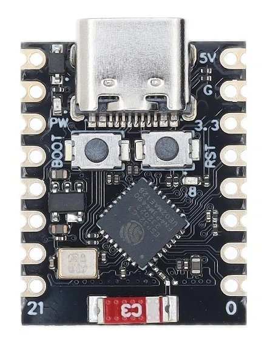
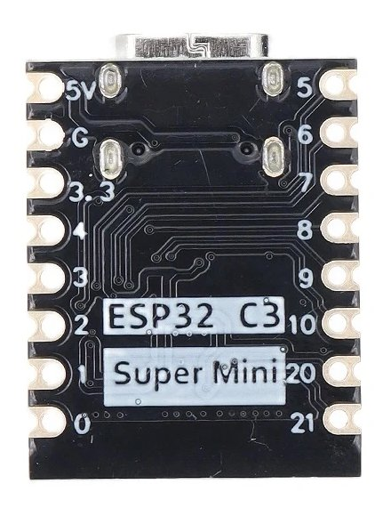

# ESP32-C3 SuperMini

## Overview

The ESP32-C3 SuperMini is a low-power and cost-effective Wi-Fi and Bluetooth dual-mode chip. It utilizes a RISC-V processor, with a single-core operating at a frequency of 160 MHz, and integrates Wi-Fi 4 and Bluetooth 5.0 wireless communication capabilities. It can be developed using the ESP-IDF development framework, including mainstream development environments such as MicroPython and Arduino. The product is suitable for IoT, smart home, sensor networks, and other fields, offering scalability and rich software support.

[ESP32-C3 Hardware Reference](https://docs.espressif.com/projects/esp-idf/en/latest/esp32c3/hw-reference/index.html).

[](pictures/ESP32-C3-SuperMini-front.jpg)
[](pictures/ESP32-C3-SuperMini-back.jpg)

## Features

- Chipset: ESP32-C3 FN4
- Wi-Fi: 2.4 GHz b/g/n
- Bluetooth: BLE 5
- Processor: 32-bit RISC-V single-core, up to 160MHz
- SRAM: 400KB
- Flash: 4MB
- Interfaces: 2x UART, 1x I²C, 3x SPI
- GPIO Pins: 11 digital (PWM), 4 analog (ADC)
- USB Type-C port
- Voltage Regulator
- Reset and Boot Buttons
- Dimensions: 22.52x18mm

### Interfaces:

- 2x ADCs
- 6x PWM channels
- 2x UART
- 1x I²C
- 3x SPI

## Boot Modes

- **SPI Boot (Default):** GPIO2 HIGH, GPIO8 Any, GPIO9 HIGH
- **UART/JTAG Download:** GPIO2 HIGH, GPIO8 HIGH, GPIO9 LOW

## Programming Tips

- If the COM port isn't recognized, enter download mode by holding BOOT while powering on or following the specified button sequence.
- After uploading, press the Reset button to execute the program.
- Ensure USB CDC On Boot is enabled for serial port printing.

## Pinout

| Silkscreen Pin | Internal Pin | Function   | Notes                                                 |
|----------------|--------------|------------|-------------------------------------------------------|
| 0              | GPIO0        | ADC1       |                                                       |
| 1              | GPIO1        | ADC1       |                                                       |
| 2              | GPIO2        | ADC1       | Boot mode / strapping pin                             |
| 3              | GPIO3        | ADC1       |                                                       |
| 4              | GPIO4        | ADC1, JTAG |                                                       |
| 5              | GPIO5        | JTAG       |                                                       |
| 6              | GPIO6        | JTAG       |                                                       |
| 7              | GPIO7        | JTAG       |                                                       |
| 8              | GPIO8        |            | Blue status_led (inverted), boot mode / strapping pin |
| 9              | GPIO9        |            | Boot mode / strapping pin, boot button                |
| 10             | GPIO10       |            |                                                       |
| 20             | GPIO20       |            |                                                       |
| 21             | GPIO21       |            |                                                       |

[](ESP32-C3-SUPERMINI-pinout.png)

- **Notes:**
    - The blue LED is controlled by GPIO8 and is inverted.
    - BOOT button is connected to GPIO9.
    - JTAG interface is available on GPIO4 to GPIO7.

### Strapping Pins:

| GPIO pin | Default  | Controls                        |
|----------|----------|---------------------------------|
| GPIO2    | Floating | Boot mode                       |
| GPIO8    | Floating | Boot mode, ROM message printing |
| GPIO9    | Pull-up  | Boot mode                       |

### Boot Modes:

| Mode               | GPIO2 | GPIO8 | GPIO9 |
|--------------------|-------|-------|-------|
| SPI boot (default) | HIGH  | Any   | HIGH  |
| UART/JTAG download | HIGH  | HIGH  | LOW   |

### Bootloader Mode:

To enter bootloader mode for programming over USB:

1. Plug in USB.
2. Hold both buttons.
3. Release both buttons simultaneously.

Before pressing the buttons, it will connect and disconnect.

### Additional Notes:

- The blue status LED is on GPIO8 and is inverted.
- The BOOT button is wired to GPIO9.
- JTAG is available on GPIO4 - GPIO7.

### ESPHOME Setup

```yaml
esp32:
  board: esp32-c3-devkitm-1
  variant: ESP32C3
  framework:
    type: esp-idf

esphome:
  platformio_options:
    board_build.flash_mode: dio
```

Config for status_led (on GPIO8):

```yaml
light:
  - platform: status_led
    name: "Status LED"
    id: esp_status_led
    icon: "mdi:alarm-light"
    pin:
      number: GPIO8
      inverted: true
    restore_mode: ALWAYS_OFF
```

## DOWNLOAD FILES

Here I share the CAD program files.

- [**KICAD**](downloads/KICAD-ESP32-C3_SUPERMINI.zip): Files for KiCad 6, includes symbol, footprint and 3D.

## Documentation Links

- [Schematic](pictures/ESP32-C3-SuperMini-schematic.png)
- [ESP32-S2 Datasheet](pdf/ESP32-C3-SuperMini-Datasheet.pdf)
