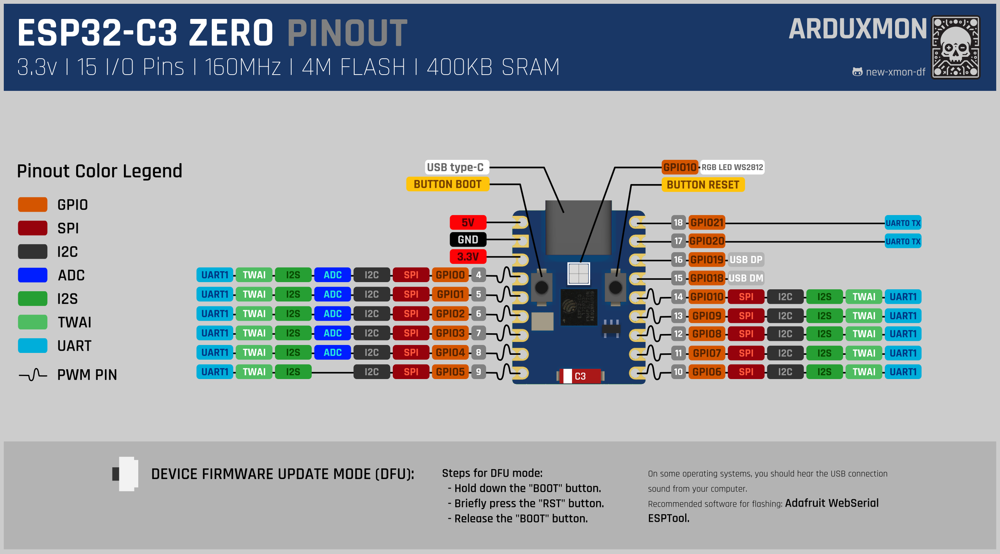

# ESP32-C3-Zero

ESP32-C3-Zero compact size, the use of half-hole process, easy to integrate into other motherboards, ESP32-C3-Zero on-board Type-C USB, in the small board Type leads most of the unused pins. The ESP32-C3FN4 is a system-on-a-chip (SoC) that integrates low-power Wi-Fi and BLE5 with 4MB Flash. In addition, there are hardware encryption accelerators, RNG, HMAC, and Digital Signature modules to meet the security requirements of the Internet of Things and rich peripheral interfaces. A variety of low-power operating states meet the power needs of Internet of Things (IoT), mobile devices, wearable electronics, smart home, and other application scenarios.

[](pictures/esp32_c3_zero_top.jpg)
[](pictures/esp32_c3_zero_bottom.jpg)

## Specifications

- **Processor:** Low power SoC equipped with RISC-V 32-bit single-core processor, up to 160MHz
- **Connectivity:** 2.4GHz Wi-Fi (802.11b/g/n) and Bluetooth® 5 (LE)
- **Memory:** Built-in 400KB SRAM and 384KB ROM, packed with 4MB Flash
- **Design:** Stamp hole design and on-board ceramic antenna, easy to integrate into user's self-designed baseplate
- **Clock and Power:** Support flexible clock, module power independent settings, and other control, to achieve multi-scenario low-power mode
- **Interfaces:** Integrated USB serial full speed controller, 15 GPIO can be flexibly configured peripheral functions
- **Peripheral Interfaces:** 3 × SPI, 1 × I2C, 2 × UART, 1 × I2S, 2 × ADC, and other peripherals
- **Special Notes:**
    - Press and hold down the BOOT (GPIO9) button each time you download the firmware before connecting the Type-C cable
    - If an external power supply is used, input 3.7V to 6V power into the half hole of the 5V silk screen

## Pin Diagram

| Pin Number | Function | Notes                          |
|------------|----------|--------------------------------|
| 1          | 5V       | Power supply input             |
| 2          | GND      | Ground                         |
| 3          | 3V3OUT   | 3.3V output                    |
| 4          | GPIO0    | UART1, PWM, SPI, I2S, ADC, I2C |
| 5          | GPIO1    | UART1, PWM, SPI, I2S           |
| 6          | GPIO2    | UART1, PWM, SPI, I2S, I2C      |
| 7          | GPIO3    | UART1, PWM, SPI, I2S, ADC, I2C |
| 8          | GPIO4    | UART1, PWM, SPI, I2S           |
| 9          | GPIO5    | UART1, PWM, SPI, I2S, ADC      |
| 10         | GPIO6    | UART1, PWM, SPI, I2S, I2C      |
| 11         | GPIO7    | UART1, PWM, SPI, I2S, ADC, I2C |
| 12         | GPIO8    | UART1, PWM, SPI, I2S           |
| 13         | GPIO9    | BOOT button                    |
| 14         | GPIO10   | UART1, PWM, SPI, I2S, I2C      |
| 15         | GPIO11   | UART1, PWM, SPI, I2S, ADC      |
| 16         | GPIO12   | UART1, PWM, SPI, I2S, I2C      |
| 17         | GPIO13   | UART1, PWM, SPI, I2S, ADC, I2C |
| 18         | GPIO14   | UART1, PWM, SPI, I2S           |
| 19         | GPIO15   | UART1, PWM, SPI, I2S, ADC      |

[](ESP32-C3-ZERO-pinout.png)

## Using with ESPHome
The WEMOS S2 Mini can be easily integrated with ESPHome for use in Home Assistant. Here are the basic steps to get started:

1. **Install ESPHome**: Follow the [installation guide](https://esphome.io/guides/installing_esphome.html) on the ESPHome website.
2. **Create a new configuration file**: Create a YAML file for your WEMOS S2 Mini. Here is an example configuration:

```yaml
esphome:
  name: esp32_c3_zero
  platformio_options:
    board_build.flash_mode: dio

esp32:
  board: esp32-c3-devkitm-1
  variant: esp32c3
  framework:
    type: esp-idf
    version: recommended

# Enable logging
logger:

# Enable Home Assistant API
api:
  encryption:
    key: !secret api_encryption_key

ota:
  password: !secret ota_password

wifi:
  ssid: !secret wifi_ssid
  password: !secret wifi_password

  # Enable fallback hotspot (captive portal) in case Wi-Fi connection fails
  ap:
    ssid: "Fallback Hotspot"
    password: !secret wifi_ap_password

# Example configuration for a binary sensor
binary_sensor:
  - platform: gpio
    name: "Button"
    pin: GPIO0
    filters:
      - invert:
      - delayed_on: 10ms
      - delayed_off: 10ms

# Example configuration for an output component
output:
  - platform: ledc
    pin: GPIO5
    id: ledc_output
    frequency: 19531Hz

# Example configuration for a light component using the output
light:
  - platform: monochromatic
    name: "LED Light"
    output: ledc_output

```
    ### Important Points:
    a. Board Configuration: The esp32-c3-devkitm-1 configuration is used as it is compatible with the ESP32-C3-Zero, ensuring proper handling of pin assignments and other hardware-specific settings​ (ESPHome)​​ (Home Assistant Community)​. 
    b. Framework: The esp-idf framework is recommended for the ESP32-C3 series. This ensures better support and stability for the specific features of the ESP32-C3​ (Albert Nisbet)​. 
    c. Flash Mode: Setting board_build.flash_mode to dio is necessary to avoid boot loops during flashing​ (Albert Nisbet)​.
    d. GPIO Usage: You can configure various GPIO pins based on your specific requirements, such as for sensors, buttons, or LEDs​ (Waveshare)​.

3. **Upload the configuration**: Use the ESPHome command line or the web interface to upload the configuration to your WEMOS S2 Mini.
4. **Integrate with Home Assistant**: Once the configuration is uploaded, the device will automatically appear in Home Assistant.

For detailed instructions and more configuration options, refer to the [ESPHome documentation](https://esphome.io/).

## DOWNLOAD FILES

Here I share the CAD program files.

- [**KICAD**](downloads/KICAD-ESP32_C3_ZERO.zip): Files for KiCad 6, includes symbol, footprint and 3D.
- [**KICAD template**](downloads/KICAD-PROJECT-TEMPLATE-ESP32-C3_ZERO.zip): Files for KiCad template.

## Documentation Links
- [ESP32-C3 Datasheet](pdf/esp32-c3_datasheet_en.pdf)
- [ESP32-C3-Zero Schematic](pdf/ESP32-C3-Zero-Sch.pdf)
- [ESP32-C3-Zero Dimensions](pictures/ESP32-C3-Zero_dimensions.jpg)
- [Official ESP32-C3-Zero Documentation](https://www.waveshare.com/wiki/ESP32-C3-Zero)

[All boards comparative](../../Docs/comparative-boards.md)