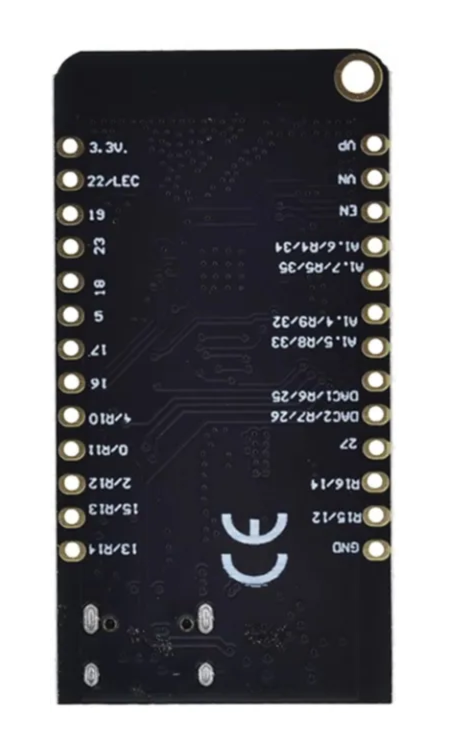
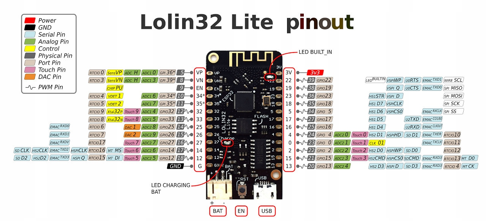
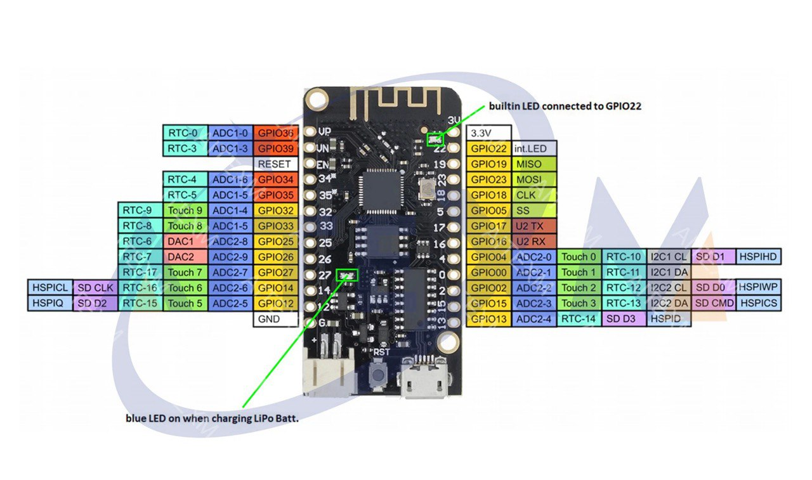

# LOLIN32 Lite
## Overview
The LOLIN32 Lite is a compact development board based on the ESP32 chip. It offers WiFi and Bluetooth connectivity, making it suitable for a wide range of IoT projects and prototyping applications. Additionally, it features a built-in battery charging circuit, allowing you to power your projects with rechargeable batteries.

[ESP32 Hardware Reference](https://docs.espressif.com/projects/esp-idf/en/v4.3/esp32/hw-reference/index.html).

## Features
### Processor:
- CPU: Xtensa dual-core (or single-core) 32-bit LX6 microprocessor, operating at 160 or 240 MHz and performing at up to 600 DMIPS
- Ultra low power (ULP) co-processor

### Memory:
- 520 KiB SRAM

### Wireless Connectivity:
- Wi-Fi: 802.11 b/g/n
- Bluetooth: v4.2 BR/EDR and BLE (shares the radio with Wi-Fi)

### Peripheral Interfaces:
- 12-bit SAR ADC up to 18 channels
- 2 × 8-bit DACs
- 10 × touch sensors (capacitive sensing GPIOs)
- 4 × SPI
- 2 × I²S interfaces
- 2 × I²C interfaces
- 3 × UART
- SD/SDIO/CE-ATA/MMC/eMMC host controller
- SDIO/SPI slave controller
- Ethernet MAC interface with dedicated DMA and IEEE 1588 Precision Time Protocol support
- CAN bus 2.0
- Infrared remote controller (TX/RX, up to 8 channels)
- Motor PWM
- LED PWM (up to 16 channels)
- Hall effect sensor
- Ultra low power analog pre-amplifier

### Security:
- IEEE 802.11 standard security features all supported, including WFA, WPA/WPA2, and WAPI
- Secure boot
- Flash encryption
- 1024-bit OTP, up to 768-bit for customers
- Cryptographic hardware acceleration: AES, SHA-2, RSA, elliptic curve cryptography (ECC), random number generator (RNG)

### Power Management:
- Internal low-dropout regulator
- Individual power domain for RTC
- 5μA deep sleep current
- Wake up from GPIO interrupt, timer, ADC measurements, capacitive touch sensor interrupt

### Battery Management:
- Connector for 3.7v battery (like 18650).

## Technical Specs
|                   |              |
|-------------------|--------------|
| Power supply      | 2.2V to 3.6V |
| Operating Voltage | 3.3V         |
| Logic level       | 3.3V         |
| Digital I/O Pins  | 27           |
| Flash             | 4M Bytes     |
| Size              | 50*25mm      |
| Weight            | 2.4g         |

## Pinout
| Board Pin Name | ESP32 Pin Number | GPIO Pin | ADC/DAC/TOUCH | Function       | RTCIO/SPI |
|----------------|------------------|----------|---------------|----------------|-----------|
| VP             | 5                | GPIO36*  | ADC H         | SENS VP        | RTCIO 0   |
| VN             | 8                | GPIO39*  | ADC H         | SENS VN        | RTCIO 3   |
| EN             | 9                | -        | -             | CHIP PU        |           |
| 34*            | 10               | GPIO34*  | -             | VDET 1         | RTCIO 4   |
| 35*            | 11               | GPIO35*  | -             | VDET 2         | RTCIO 5   |
| 32             | 12               | GPIO32   | TOUCH 9       | Xtal 32 P      | RTCIO 9   |
| 33             | 13               | GPIO33   | TOUCH 8       | Xtal 32 N      | RTCIO 8   |
| 25             | 14               | GPIO25   | DAC 1         | -              | RTCIO 6   |
| 26             | 15               | GPIO26   | DAC 2         | -              | RTCIO 7   |
| 27             | 16               | GPIO27   | TOUCH 7       | -              | RTCIO 17  |
| 14             | 17               | GPIO14   | TOUCH 6       | MT MS          | RTCIO 16  |
| 12             | 18               | GPIO12   | TOUCH 5       | MT DI          | RTCIO 15  |
| G              | G                | -        | -             | -              | -         |
| 3V             | 3V               | -        | -             | -              | -         |
| 22             | 39               | GPIO22   | -             | LED BUILTIN    | WIRE SCL  |
| 19             | 38               | GPIO19   | -             | -              | SPI MISO  |
| 23             | 36               | GPIO23   | -             | -              | SPI MOSI  |
| 18             | 35               | GPIO18   | -             | -              | SPI SCK   |
| 5              | 34               | GPIO5    | -             | -              | SPI SS    |
| 17             | 27               | GPIO17   | -             | -              | -         |
| 16             | 25               | GPIO16   | -             | -              | -         |
| 4              | 24               | GPIO4    | TOUCH 0       | -              | RTCIO 10  |
| 0              | 23               | GPIO0    | TOUCH 1       | CLK 01         | RTCIO 11  |
| 2              | 22               | GPIO2    | TOUCH 2       | -              | RTCIO 12  |
| 15             | 21               | GPIO15   | TOUCH 3       | -              | RTCIO 13  |
| 13             | 20               | GPIO13   | -             | -              | RTCIO 14  |

## Documentation Links
- [Schematic](pdf/sch_lolin32_lite_v1.0.0.pdf)