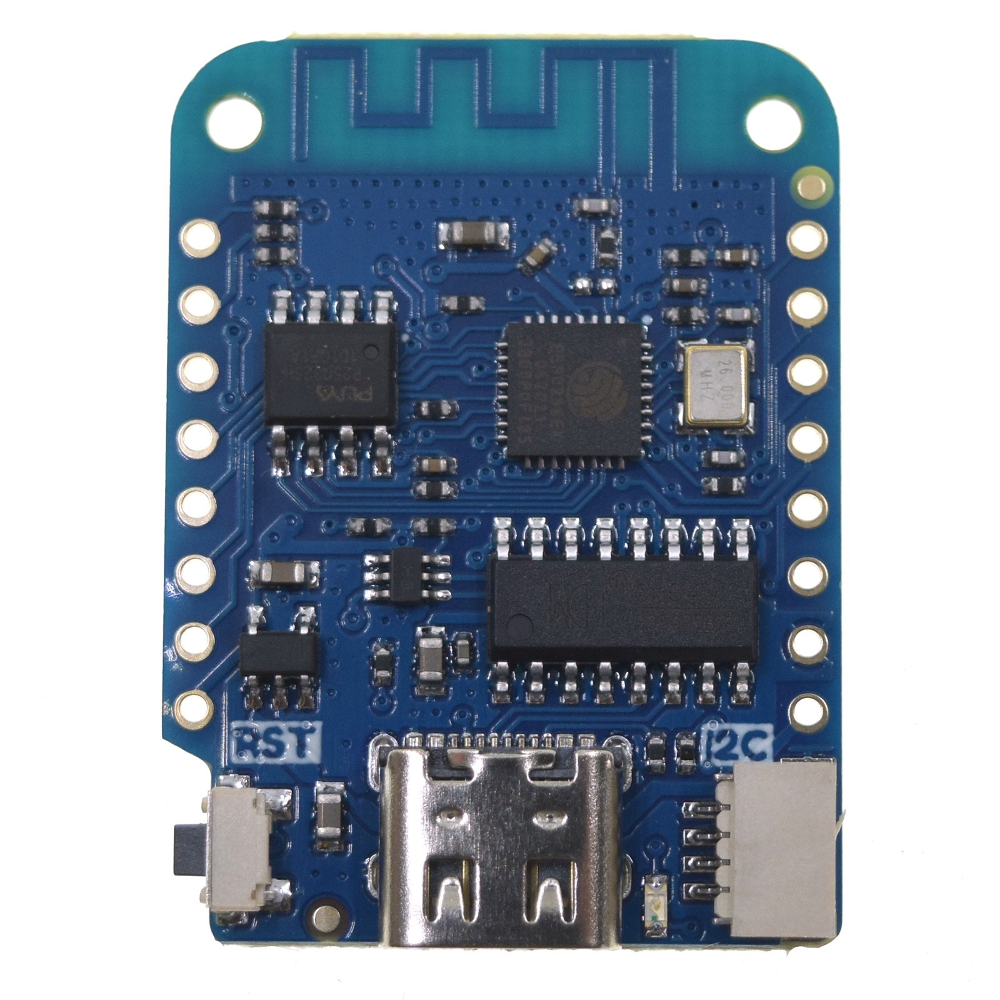

# WEMOS D1 MINI **v4** 
#### (older v1, v2, v3)

## Overview
The WEMOS D1 MINI boards are compact and powerful ESP8266-based microcontrollers. They offer WiFi connectivity and a small form factor, making them ideal for IoT projects that require wireless communication.

## Features
- 11 digital IO, interrupt/pwm/I2C/one-wire supported(except D0)
- 1 analog input(3.2V max input)
- Type-C USB Port
- LOLIN I2C Port
- Compatible with MicroPython, Arduino, nodemcu

## Technical Specs
|                   |             |
|-------------------|-------------|
| Operating Voltage | 3.3V        |
| Digital I/O Pins  | 11          |
| Analog Input Pins | 1(3.2V Max) |
| Clock Speed       | 80/160MHz   |
| Flash             | 4M Bytes    |
| Size              | 34.2*25.6mm |
| Weight            | 3g          |

## Pinout
| Pin | Function                     | ESP-8266 Pin |
|-----|------------------------------|--------------|
| RST | Reset                        | RST          |
| A0  | Analog input, max 3.2V       | A0           |
| D0  | IO                           | GPIO16       |
| D5  | IO, SCK                      | GPIO14       |
| D6  | IO, MISO                     | GPIO12       |
| D7  | IO, MOSI                     | GPIO13       |
| D8  | IO, 10k Pull-down, SS        | GPIO15       |
| 3V3 | 3.3V                         | 3.3V         |
| TX  | TXD                          | TXD          |
| RX  | RXD                          | RXD          |
| D1  | IO, SCL                      | GPIO5        |
| D2  | IO, SDA                      | GPIO4        |
| D3  | IO, 10k Pull-up              | GPIO0        |
| D4  | IO, 10k Pull-up, BUILTIN_LED | GPIO2        |
| G   | Ground                       | GND          |
| 5V  | 5V                           | -            |

## Documentation Links
- [Schematic v4](pdf/sch_d1_mini_v4.0.0.pdf)
- [Official WEMOS D1 MINI Documentation](https://www.wemos.cc/en/latest/d1/d1_mini.html)

## Versions
- **v4.0** (current)
- **v3.1**
- **v3.0**
- **v2.0**
- **v1.0**
