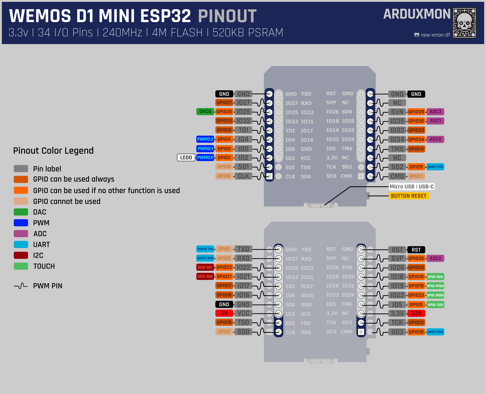

# WEMOS D1 MINI ESP32 V2.0

## Description
The WEMOS D1 Mini ESP32 Development Board is the successor of the D1 Mini with the ESP8266. Its pins are compatible with all modules designed for the D1 Mini ESP8266 and incorporate all the additional improvements of the powerful ESP32.

The ESP32 integrates Wi-Fi and Bluetooth BLE, making it ideal for developing IoT products. Wi-Fi allows for medium-range communication and connection to a LAN network and, through a router, to the Internet. Bluetooth enables direct connection to another device such as a cellphone.

The ESP32 chip's standby current is less than 5 µA, making it suitable for portable electronic applications with batteries.

At the core of this module is the ESP32-D0WDQ6 chip. The integrated chip is designed to be scalable and adaptable, featuring two CPU cores that can be controlled individually and a clock frequency adjustable from 80 MHz to 240 MHz.

## Features
| Feature                                        | Description                                                                                                                                                             |
|------------------------------------------------|-------------------------------------------------------------------------------------------------------------------------------------------------------------------------|
| Robust design                                  | ESP32 is capable of reliable operation in industrial environments, with an operating temperature range from -40°C to +125°C.                                            |
| Ultra-low power consumption                    | Designed for mobile devices, wearable electronics, and IoT applications, ESP32 achieves ultra-low power consumption with a combination of various proprietary software. |
| High level of integration                      | ESP32 is highly integrated with built-in antenna switches, RF balun, power amplifiers, low-noise amplifiers, filters, and power management modules.                     |
| Wi-Fi and Bluetooth BLE connectivity           | Integrates Wi-Fi and Bluetooth BLE, allowing for a wide range of IoT applications and direct connections to other devices.                                              |
| Compatible with Arduino IDE                    | Can be programmed using the Arduino IDE, providing access to a wide range of resources and libraries available in the Arduino ecosystem.                                |
| Wide range of GPIOs, UART, SPI, I2C interfaces | Offers multiple GPIOs, UART, SPI, and I2C interfaces for connecting various sensors and peripherals.                                                                    |
| Capacitive touch sensors                       | Features capacitive touch sensors on 10 GPIOs, enabling the creation of touch-sensitive interfaces.                                                                     |
| SD card interface                              | Includes an interface for SD cards, allowing for additional storage options.                                                                                            |
| Integrated TCP/IP protocol stack               | Comes with an integrated TCP/IP protocol stack, simplifying network communication.                                                                                      |
| FCC/CE/IC/TELEC/KCC/SRRC/NCC certified         | Certified for compliance with FCC/CE/IC/TELEC/KCC/SRRC/NCC regulations.                                                                                                 |
| Wide range of network protocols supported      | Supports IPv4, IPv6, SSL, TCP, UDP, HTTP, FTP, MQTT, and other network protocols.                                                                                       |
| Audio support for CVSD and SBC formats         | Provides support for CVSD and SBC audio formats.                                                                                                                        |

## Technical Specifications
| Specification                | Details                                                                                |
|------------------------------|----------------------------------------------------------------------------------------|
| Operating Voltage            | 5V DC (4.5~6V)                                                                         |
| Operating Current            | ~80mA (source >500mA)                                                                  |
| Logic Level (Inputs/Outputs) | 3.3V                                                                                   |
| SoC                          | ESP32 (ESP32-D0WDQ6)                                                                   |
| CPU                          | Dual-core Tensilica LX6 (32-bit)                                                       |
| Clock Frequency              | 80MHz to 240MHz                                                                        |
| SRAM                         | 520KB                                                                                  |
| External Flash Memory        | 4MB                                                                                    |
| Digital GPIO Pins            | 34 (including all peripherals)                                                         |
| UART                         | 2                                                                                      |
| SPI                          | 3                                                                                      |
| I2C                          | 2                                                                                      |
| Capacitive Touch Sensors     | 10                                                                                     |
| SD Interface                 | Yes                                                                                    |
| Timers                       | 3 (16-bit)                                                                             |
| PWM Channels                 | 16 independent channels (16-bits)                                                      |
| ADC                          | 18CH (12-bit)                                                                          |
| DAC                          | 2 (8-bit)                                                                              |
| Wi-Fi Protocol               | 802.11 b/g/n/e/i (802.11n up to 150 Mbps)                                              |
| Wi-Fi Security               | WPA/WPA2/WPA2-Enterprise/WPS                                                           |
| Bluetooth Protocols          | V4.2 BR/EDR and BLE specification                                                      |
| Bluetooth Radios             | NZIF receiver with -97 dBm sensitivity, Class-1, class-2, and class-3 transmitter, AFH |
| Network Protocols            | IPv4, IPv6, SSL, TCP/UDP/HTTP/FTP/MQTT                                                 |

## Pinout
[](wemos-d1-mini-esp32-pinout.png)[pending]

## Using with ESPHome
The WEMOS D1 Mini ESP32 can be easily integrated with ESPHome for use in Home Assistant. Here are the basic steps to get started:

1. **Install ESPHome**: Follow the [installation guide](https://esphome.io/guides/installing_esphome.html) on the ESPHome website.
2. **Create a new configuration file**: Create a YAML file for your WEMOS D1 Mini ESP32. Here is an example configuration:

    ```yaml
    esphome:
      name: wemos_d1_mini_esp32
      friendly_name: WEMOS D1 MINI ESP32
      comment: Template for this board
   
    esp32:
      board: wemos_d1_mini32 # https://docs.platformio.org/en/latest/boards/espressif32/wemos_d1_mini32.html
      framework:
        type: arduino

    wifi:
      ssid: "your_SSID"
      password: "your_PASSWORD"

    # Enable logging
    logger:

    # Enable Home Assistant API
    api:
      password: "your_API_password"

    ota:
      password: "your_OTA_password"

    # Example configuration entry for a GPIO switch
    switch:
      - platform: gpio
        name: "Wemos D1 Mini ESP32 Switch"
        pin: GPIO16
    ```

3. **Upload the configuration**: Use the ESPHome command line or the web interface to upload the configuration to your WEMOS D1 Mini ESP32.
4. **Integrate with Home Assistant**: Once the configuration is uploaded, the device will automatically appear in Home Assistant.

For detailed instructions and more configuration options, refer to the [ESPHome documentation](https://esphome.io/).

## DOWNLOAD FILES

Here I share the CAD program files.

- [**KICAD**](downloads/KICAD-WEMOS_D1_MINI_ESP32.zip): Files for KiCad 6, includes symbol, footprint and 3D.

## Documentation Links
- [Schematic](pdf/***)[pending]
- [Official WEMOS D1 MINI ESP32 Documentation](https://www.wemos.cc/en/latest/d1/d1_mini32.html)

## Versions
- **V2.0** (current)
