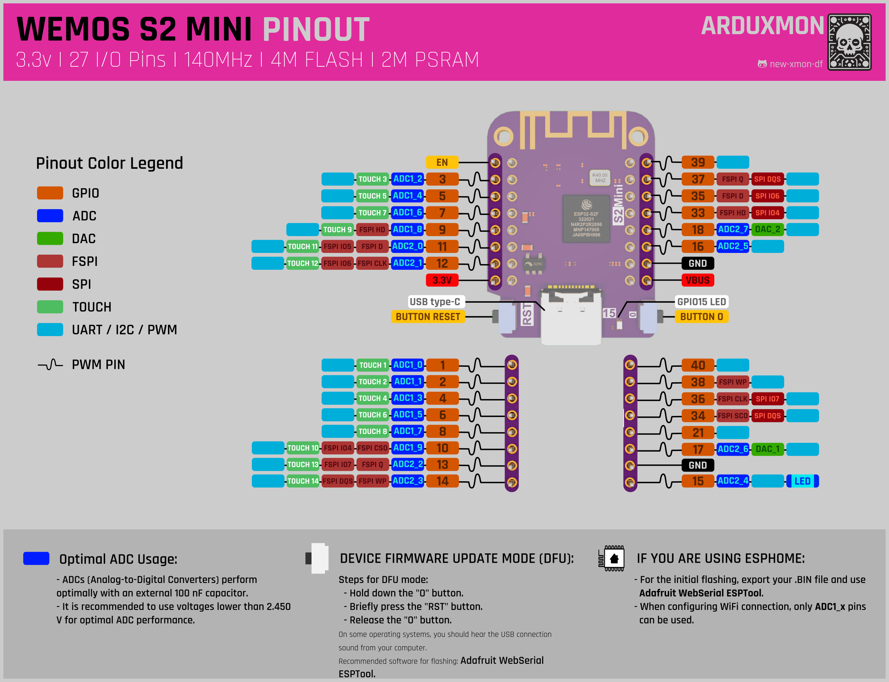

# WEMOS S2 MINI

## Overview
The WEMOS S2 Mini is a compact microcontroller board based on the ESP32-S2 chip. It offers Wi-Fi connectivity and a small form factor, making it suitable for IoT projects that require wireless communication and advanced features.

[ESP32-S2 Hardware Reference](https://docs.espressif.com/projects/esp-idf/en/latest/esp32s2/hw-reference/index.html).

[](pictures/s2_mini_v1.0.0_1_16x16.jpg)
[](pictures/s2_mini_v1.0.0_2_16x16.jpg)

## Features
- Based on ESP32-S2FN4R2 Wi-Fi IC
- Type-C USB
- 4MB Flash
- 2MB PSRAM
- 27x IO
- ADC, DAC, I2C, SPI, UART, USB OTG
- Compatible with LOLIN D1 mini shields
- Compatible with MicroPython, Arduino, CircuitPython, and ESP-IDF
- Default firmware: MicroPython

## Technical Specs
|                   |                |
|-------------------|----------------|
| Operating Voltage | 3.3V           |
| Digital I/O Pins  | 27             |
| Clock Speed       | 240MHz         |
| Flash             | 4M Bytes       |
| PSRAM             | 2M Bytes       |
| Size              | 34.3 x 25.4 mm |
| Weight            | 2.4g           |

## Device Firmware Upgrade (DFU) Mode
To enter DFU mode:
- Hold button 0
- Short-press Button RST
- Release button 0
  You should hear the USB connect sound from your computer.

## Pinout
| Pin Number | Function           | ADC    | SPI                | DAC   | TOUCH    | UART/I2C/PWM |
|------------|--------------------|--------|--------------------|-------|----------|--------------|
| EN         | Enable             | -      | -                  | -     | -        | -            |
| GPIO3      | Digital I/O        | ADC1_2 | -                  | -     | TOUCH_3  | **✓**        |
| GPIO5      | Digital I/O        | ADC1_4 | -                  | -     | TOUCH_5  | **✓**        |
| GPIO7      | Digital I/O (SCK)  | ADC1_6 | -                  | -     | TOUCH_7  | **✓**        |
| GPIO9      | Digital I/O (MISO) | ADC1_8 | FSPI HD            | -     | TOUCH_9  | **✓**        |
| GPIO11     | Digital I/O (MOSI) | ADC2_0 | FSPI D, FSPI IO5   | -     | TOUCH_11 | **✓**        |
| GPIO12     | Digital I/O        | ADC2_1 | FSPI CLK, FSPI IO6 | -     | TOUCH_12 | **✓**        |
| 3.3V       | Power              | -      | -                  | -     | -        | -            |
| GPIO1      | Digital I/O        | ADC1_0 | -                  | -     | TOUCH_1  | **✓**        |
| GPIO2      | Digital I/O        | ADC1_1 | -                  | -     | TOUCH_2  | **✓**        |
| GPIO4      | Digital I/O        | ADC1_3 | -                  | -     | TOUCH_4  | **✓**        |
| GPIO6      | Digital I/O        | ADC1_5 | -                  | -     | TOUCH_6  | **✓**        |
| GPIO8      | Digital I/O        | ADC1_7 | -                  | -     | TOUCH_8  | **✓**        |
| GPIO10     | Digital I/O        | ADC1_9 | FSPI CS0, FSPI IO4 | -     | TOUCH_10 | **✓**        |
| GPIO13     | Digital I/O        | ADC2_2 | FSPI Q, FSPI IO7   | -     | TOUCH_13 | **✓**        |
| GPIO14     | Digital I/O        | ADC2_3 | FSPI WP, FSPI DQS  | -     | TOUCH_14 | **✓**        |
| GPIO40     | Digital I/O        | -      | -                  | -     | -        | **✓**        |
| GPIO38     | Digital I/O        | -      | FSPI WP            | -     | -        | **✓**        |
| GPIO36     | Digital I/O        | -      | FSPI CLK, FSPI IO7 | -     | -        | **✓**        |
| GPIO34     | Digital I/O        | -      | FSPI SC0, FSPI DQS | -     | -        | **✓**        |
| GPIO21     | Digital I/O        | -      | -                  | -     | -        | **✓**        |
| GPIO17     | Digital I/O        | ADC2_6 | -                  | DAC_1 | -        | **✓**        |
| GND        | Ground             | -      | -                  | -     | -        | -            |
| GPIO15     | Digital I/O        | ADC2_4 | -                  | -     | -        | **✓**        |
| GPIO39     | Digital I/O        | -      | -                  | -     | -        | **✓**        |
| GPIO37     | Digital I/O        | -      | FSPI Q, FSPI DQS   | -     | -        | **✓**        |
| GPIO35     | Digital I/O (SCL)  | -      | FSPI D, FSPI IO6   | -     | -        | **✓**        |
| GPIO33     | Digital I/O (SDA)  | -      | FSPI HD, FSPI IO4  | -     | -        | **✓**        |
| GPIO18     | Digital I/O        | ADC2_7 | -                  | DAC_2 | -        | **✓**        |
| GPIO16     | Digital I/O        | ADC2_5 | -                  | -     | -        | **✓**        |
| GND        | Ground             | -      | -                  | -     | -        | -            |
| BUS        | Power              | -      | -                  | -     | -        | -            |

[](WEMOS-ESP32-S2-MINI-pinout.png)

## Using with ESPHome
The WEMOS S2 Mini can be easily integrated with ESPHome for use in Home Assistant. Here are the basic steps to get started:

1. **Install ESPHome**: Follow the [installation guide](https://esphome.io/guides/installing_esphome.html) on the ESPHome website.
2. **Create a new configuration file**: Create a YAML file for your WEMOS S2 Mini. Here is an example configuration:

    ```yaml
    esphome:
      name: wemos_s2_mini
      friendly_name: WEMOS S2 MINI
      comment: Template for this board
   
    esp32:
      board: lolin_s2_mini # https://www.wemos.cc/en/latest/s2/s2_mini.html
      framework:
        type: arduino
   
    wifi:
      ssid: "your_SSID"
      password: "your_PASSWORD"

    # Enable logging
    logger:

    # Enable Home Assistant API
    api:
      password: "your_API_password"

    ota:
      password: "your_OTA_password"

    # Example configuration entry for a GPIO switch
    switch:
      - platform: gpio
        name: "Wemos S2 Mini Switch"
        pin: GPIO16
    ```

3. **Upload the configuration**: Use the ESPHome command line or the web interface to upload the configuration to your WEMOS S2 Mini.
4. **Integrate with Home Assistant**: Once the configuration is uploaded, the device will automatically appear in Home Assistant.

For detailed instructions and more configuration options, refer to the [ESPHome documentation](https://esphome.io/).


## DOWNLOAD FILES

Here I share the CAD program files.

- [**KICAD**](downloads/KICAD-WEMOS_S2_MINI.zip): Files for KiCad, includes symbol, footprint and 3D.
- [**KICAD template**](downloads/KICAD-PROJECT-TEMPLATE-ESP32-WEMOS_S2_MINI.zip): Files for KiCad template.

## Documentation Links
- [Dimensions](pdf/dim_s2_mini_v1.0.0.pdf)
- [Schematic](pdf/sch_s2_mini_v1.0.0.pdf)
- [ESP32-S2 Datasheet](pdf/esp32-s2_datasheet_en.pdf)
- [Official WEMOS D1 MINI Documentation](https://www.wemos.cc/en/latest/s2/s2_mini.html)


[All boards comparative](../../Docs/comparative-boards.md)