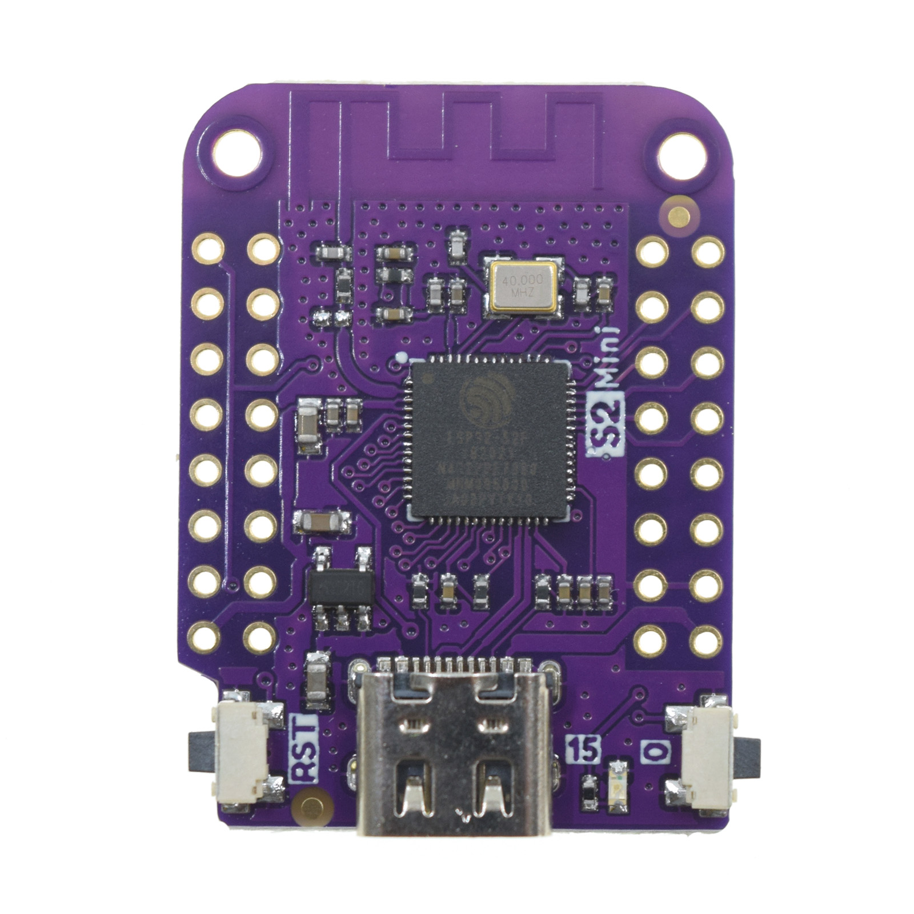
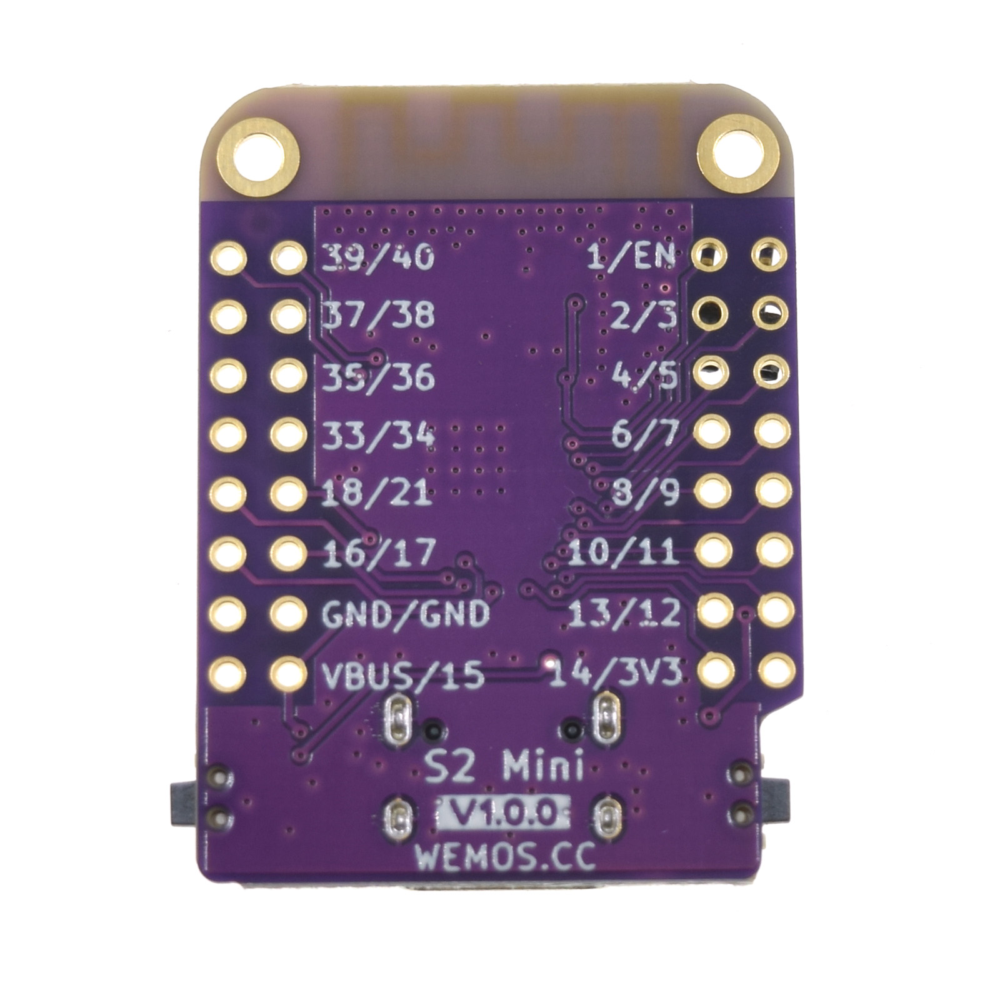

# WEMOS S2 MINI

## Overview
The WEMOS S2 Mini is a compact microcontroller board based on the ESP32-S2 chip. It offers WiFi connectivity and a small form factor, making it suitable for IoT projects that require wireless communication and advanced features.

## Features
- based ESP32-S2FN4R2 WIFI IC
- Type-C USB
- 4MB Flash
- 2MB PSRAM
- 27x IO
- ADC, DAC, I2C, SPI, UART, USB OTG
- Compatible with LOLIN D1 mini shields
- Compatible with MicroPython, Arduino, CircuitPython and ESP-IDF
- Default firmware: MicroPython

## Technical Specs
|                   |             |
|-------------------|-------------|
| Operating Voltage | 3.3V        |
| Digital I/O Pins  | 27          |
| Clock Speed       | 240MHz      |
| Flash             | 4M Bytes    |
| PSRAM             | 2M Bytes    |
| Size              | 34.3*25.4mm |
| Weight            | 2.4g        |

## Device Firmware Upgrade (DFU) Mode
To enter DFU mode:
- Hold button 0
- Short-press Button RST
- Release button 0
You should hear the USB connect sound from your computer.

## Pinout
| Pin Number | Function           | ADC    | SPI                | DAC   | TOUCH    | UART/I2C/PWM |
|------------|--------------------|--------|--------------------|-------|----------|--------------|
| EN         | Enable             | -      | -                  | -     | -        | -            |
| IO3        | Digital I/O        | ADC1_2 | -                  | -     | TOUCH_3  | **✓**        |
| IO5        | Digital I/O        | ADC1_4 | -                  | -     | TOUCH_5  | **✓**        |
| IO7        | Digital I/O (SCK)  | ADC1_6 | -                  | -     | TOUCH_7  | **✓**        |
| IO9        | Digital I/O (MISO) | ADC1_8 | FSPI HD            | -     | TOUCH_9  | **✓**        |
| IO11       | Digital I/O (MOSI) | ADC2_0 | FSPI D, FSPI IO5   | -     | TOUCH_11 | **✓**        |
| IO12       | Digital I/O        | ADC2_1 | FSPI CLK, FSPI IO6 | -     | TOUCH_12 | **✓**        |
| 3.3V       | Power              | -      | -                  | -     | -        | -            |
| IO1        | Digital I/O        | ADC1_0 | -                  | -     | TOUCH_1  | **✓**        |
| IO2        | Digital I/O        | ADC1_1 | -                  | -     | TOUCH_2  | **✓**        |
| IO4        | Digital I/O        | ADC1_3 | -                  | -     | TOUCH_4  | **✓**        |
| IO6        | Digital I/O        | ADC1_5 | -                  | -     | TOUCH_6  | **✓**        |
| IO8        | Digital I/O        | ADC1_7 | -                  | -     | TOUCH_8  | **✓**        |
| IO10       | Digital I/O        | ADC1_9 | FSPI CS0, FSPI IO4 | -     | TOUCH_10 | **✓**        |
| IO13       | Digital I/O        | ADC2_2 | FSPI Q, FSPI IO7   | -     | TOUCH_13 | **✓**        |
| IO14       | Digital I/O        | ADC2_3 | FSPI WP, FSPI DQS  | -     | TOUCH_14 | **✓**        |
| IO40       | Digital I/O        | -      | -                  | -     | -        | **✓**        |
| IO38       | Digital I/O        | -      | FSPI WP            | -     | -        | **✓**        |
| IO36       | Digital I/O        | -      | FSPI CLK, FSPI IO7 | -     | -        | **✓**        |
| IO34       | Digital I/O        | -      | FSPI SC0, FSPI DQS | -     | -        | **✓**        |
| IO21       | Digital I/O        | -      | -                  | -     | -        | **✓**        |
| IO17       | Digital I/O        | ADC2_6 | -                  | DAC_1 | -        | **✓**        |
| GND        | Ground             | -      | -                  | -     | -        | -            |
| IO15       | Digital I/O        | ADC2_4 | -                  | -     | -        | **✓**        |
| IO39       | Digital I/O        | -      | -                  | -     | -        | **✓**        |
| IO37       | Digital I/O        | -      | FSPI Q, FSPI DQS   | -     | -        | **✓**        |
| IO35       | Digital I/O (SCL)  | -      | FSPI D, FSPI IO6   | -     | -        | **✓**        |
| IO33       | Digital I/O (SDA)  | -      | FSPI HD, FSPI IO4  | -     | -        | **✓**        |
| IO18       | Digital I/O        | ADC2_7 | -                  | DAC_2 | -        | **✓**        |
| IO16       | Digital I/O        | ADC2_5 | -                  | -     | -        | **✓**        |
| GND        | Ground             | -      | -                  | -     | -        | -            |
| VBUS       | Power              | -      | -                  | -     | -        | -            |

## Documentation Links
- [Dimensions](pdf/dim_s2_mini_v1.0.0.pdf)
- [Schematic](pdf/sch_s2_mini_v1.0.0.pdf)
- [ESP32-S2 Datasheet](pdf/esp32-s2_datasheet_en.pdf)
- [Official WEMOS D1 MINI Documentation](https://www.wemos.cc/en/latest/s2/s2_mini.html)
