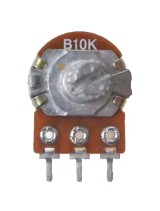
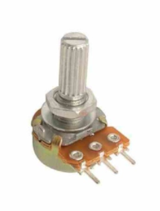
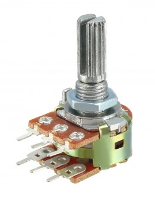
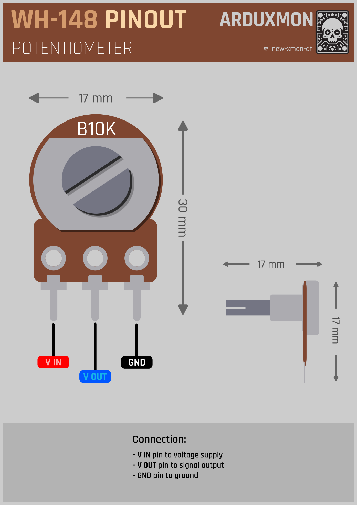

# WH148 10 kΩ Rotary Potentiometer

## Description

The WH148 is a rotary potentiometer, while I primarily use the 10 kΩ version, but is available in other resistance values to suit various applications. It is commonly used for adjusting parameters such as volume, brightness, or other analog values in electronic circuits. The WH148 is known for its reliability and smooth adjustment, making it ideal for both DIY projects and professional applications.

## Features

- **Resistance**: 10 kΩ ± 20%
- **Type**: Rotary potentiometer
- **Adjustment**: 300° rotation
- **Build**: Metal shaft, threaded for panel mounting
- **Pins**: 3-pin configuration (two terminals and a wiper)
- **Durability**: Over 10,000 cycles of operation
- **Mounting**: Suitable for panel mounting with a nut and washer

## Technical Specifications

- **Resistance**: 10 kΩ
- **Tolerance**: ±20%
- **Power Rating**: 0.125 W (1/8 W)
- **Maximum Voltage**: 200 VDC
- **Rotation Angle**: 300° ± 5°
- **Operating Temperature**: -10°C to +70°C
- **Shaft Length**: 15 mm (excluding thread)
- **Thread Diameter**: 7 mm

## How it Works

The WH148 functions as a variable resistor. By rotating the shaft, the wiper moves along the resistive track, adjusting the resistance between the pins. This allows the user to fine-tune an electrical parameter, such as signal level, by dividing voltage or regulating current in a circuit.

## Usage Instructions

### Wiring

The potentiometer has three pins:

- **Pin 1 (Terminal 1)**: Connect to the input voltage or signal
- **Pin 2 (Wiper)**: Connect to the circuit where the variable signal or voltage is needed
- **Pin 3 (Terminal 2)**: Connect to ground or the other end of the signal source

### Example Applications

1. **Volume Control**: Connect the potentiometer to the audio signal path. The wiper (Pin 2) provides the adjusted audio signal to the amplifier or speakers.
2. **LED Brightness Control**: Use the potentiometer to adjust the current flow to an LED circuit for variable brightness.
3. **Sensor Calibration**: Fine-tune sensor thresholds by connecting the potentiometer in parallel or series with the sensor.

## Pinout

## Documentation Links

- [Datasheet](pdf/WH148-datasheet.pdf)
