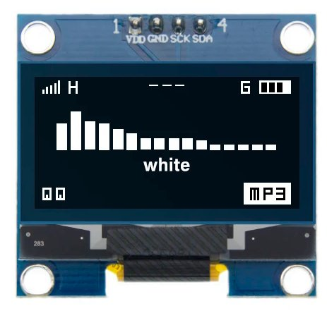
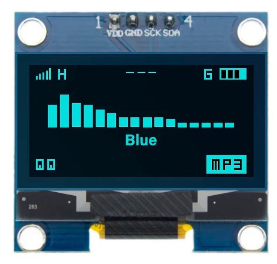
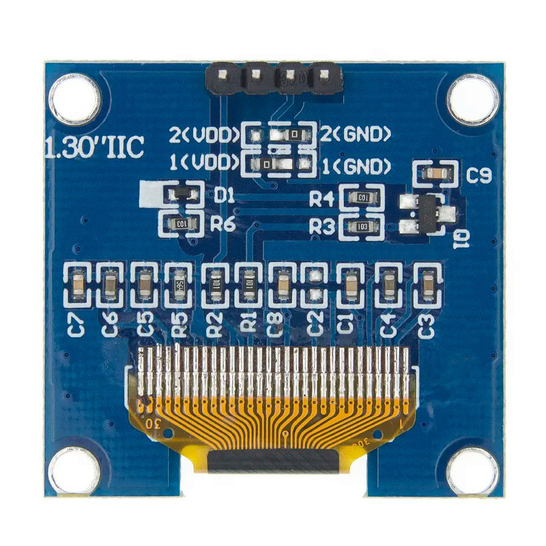

# SH1106 Display

The **SH1106** display is a popular choice among hobbyists and professionals alike, offering high contrast and excellent visibility in various lighting conditions. Here's what you need to know about integrating the SH1106 display into your IoT projects:

## Description
  The SH1106 is a versatile OLED display controller known for its compatibility with a wide range of microcontrollers and development platforms. With its high contrast ratio and low power consumption, it's suitable for applications requiring clear and crisp visual output.

## Technical Specifications
  - Resolution: 128x64 pixels
  - Interface: I2C or SPI
  - Display Color: Monochrome (typically white or blue)
  - Driver Chip: SH1106
  - Operating Voltage: Typically 3.3V or 5V

## Features
  - High contrast ratio for excellent visibility.
  - Wide operating temperature range.
  - Compatible with various microcontrollers and development platforms.
  - Low power consumption, making it suitable for battery-powered applications.
  - Support for both I2C and SPI communication interfaces.

## Integration
  Integrating the **SH1106** display into your project is straightforward, thanks to its compatibility with popular development platforms and libraries. Simply connect the display to your microcontroller using the I2C or SPI interface and use the appropriate library to control it.

## Projects
  Explore examples of projects incorporating the **SH1106** display for inspiration and guidance on how to leverage its capabilities in your own projects.

## Documentation Links
- [Dimensions](dimension.jpg)
- [Datasheet](pdf/SH1106%20datasheet.pdf)