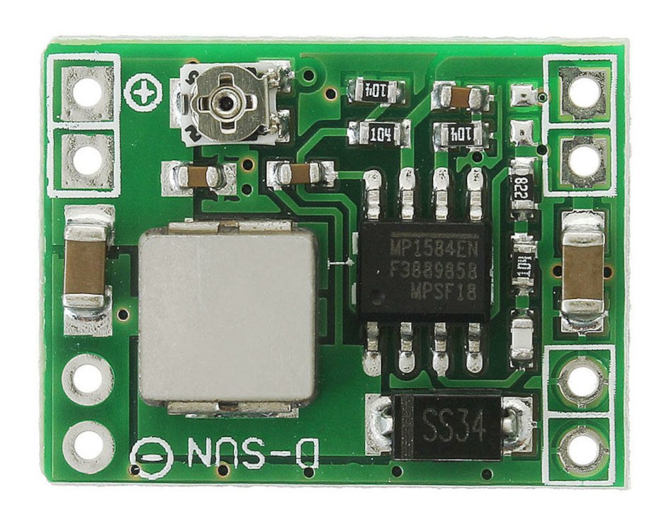
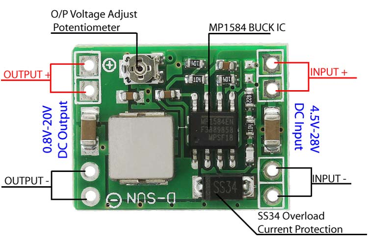

# MP1584EN Step-Down Converter

The MP1584EN is a high-efficiency, step-down (buck) DC-DC converter capable of delivering up to 3A of output current. It
is designed for applications requiring efficient voltage regulation in a compact form factor, making it ideal for
battery-powered devices, portable electronics, and embedded systems.

## Specifications

- **Input Voltage Range**: 4.5V to 28V
- **Output Voltage Range**: 0.8V to 20V
- **Output Current**: Up to 3A
- **Conversion Efficiency**: Up to 92%
- **Output Ripple**: Less than 30mV
- **Switching Frequency**: 1.5MHz (highest), typically 1MHz
- **Operating Temperature**: -45°C to 85°C
- **Size**: 22mm x 17mm x 4mm

## Features

- High efficiency over a wide load range
- Integrated high-side MOSFET
- Adjustable output voltage
- Fixed 1.5MHz switching frequency
- Thermal shutdown and over-current protection
- Low shutdown current

## Applications

- Battery-powered devices
- Portable electronics
- Embedded systems
- Power supply for microcontrollers and other digital circuits
- LED drivers
- DIY mobile power
- Monitor power supply
- Camera power supply
- Car power
- Communications equipment supply

## Pinout

1. **EN**: Enable pin. Drive high to enable the regulator, low to disable.
2. **VIN+**: Input voltage positive pin. Connect to the input power supply.
3. **VIN-**: Input voltage negative pin. Connect to the input ground.
4. **VOUT+**: Output voltage positive pin. Connect to the output load.
5. **VOUT-**: Output voltage negative pin. Connect to the output ground.

## Module Overview

- **Adjustable Potentiometer**: Rotate clockwise to step-down the voltage, counterclockwise to step-up the voltage.
- **Warning**:
    - Do not reverse the positive and negative terminals to avoid damage.
    - Do not use without load or with a light load (less than 10% of output power).

## Usage Notes

- Ensure adequate heat dissipation for the MP1584EN in high-current applications.
- Proper layout of the PCB is critical for minimizing noise and ensuring stable operation.
- Use low ESR capacitors for input and output to improve efficiency and reduce voltage ripple.

## Documentation Links

- [Datasheet](pdf/MP1584-Datasheet.pdf).
