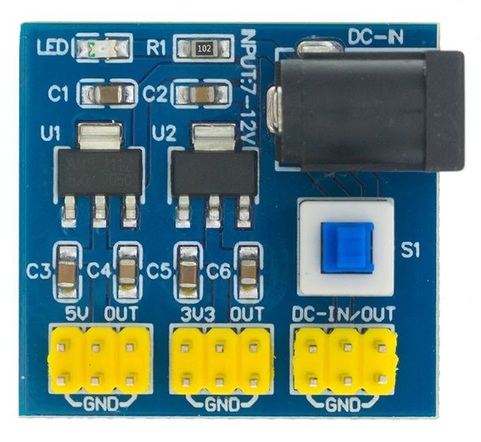

# DC-DC 12V to 3.3V 5V Buck Converter Module (T89)

## Description
The DC-DC 12V to 3.3V 5V Buck Converter Module is a step-down voltage converter that takes a 12V DC input and provides regulated outputs of 3.3V and 5V. It is ideal for electronics projects requiring different voltage levels from a single 12V power source.

## Specifications
- **Input Voltage:** 7-12V DC
- **Output Voltages:** 3.3V DC, 5V DC
- **Maximum Input Current:** the input current cannot exceed 800ma
- **Maximum Output Current:** Variable depending on the load and selected output voltage
- **Efficiency:** Typically over 80%
- **Dimensions:** 4.5 x 4.5 cm. Compact and easy to integrate into various electronic projects

## Connections
- **Input (IN):**
    - **VIN+:** Connects to the positive terminal of the 12V power supply.
    - **VIN-:** Connects to the negative terminal of the 12V power supply.
- **Output (OUT):**
    - **3.3V:** Terminal for 3.3V regulated output.
    - **5V:** Terminal for 5V regulated output.
    - **GND:** Common ground for the outputs.

## Key Features
- **Voltage Regulation:** Provides stable and precise output voltages of 3.3V and 5V from a 12V input.
- **Integrated Protection:** Features protection against overload and short-circuit to prevent damage to the module and connected devices.
- **Versatile Use:** Suitable for powering microcontrollers, sensors, and other electronic components requiring specific voltages.

## Applications
- **Arduino and Raspberry Pi Projects:** Used to supply the necessary voltages for various boards and modules.
- **Embedded Systems:** Ideal for embedded systems requiring a reliable and regulated power source.
- **DIY Electronics Projects:** Perfect for home electronics projects needing multiple voltage levels.