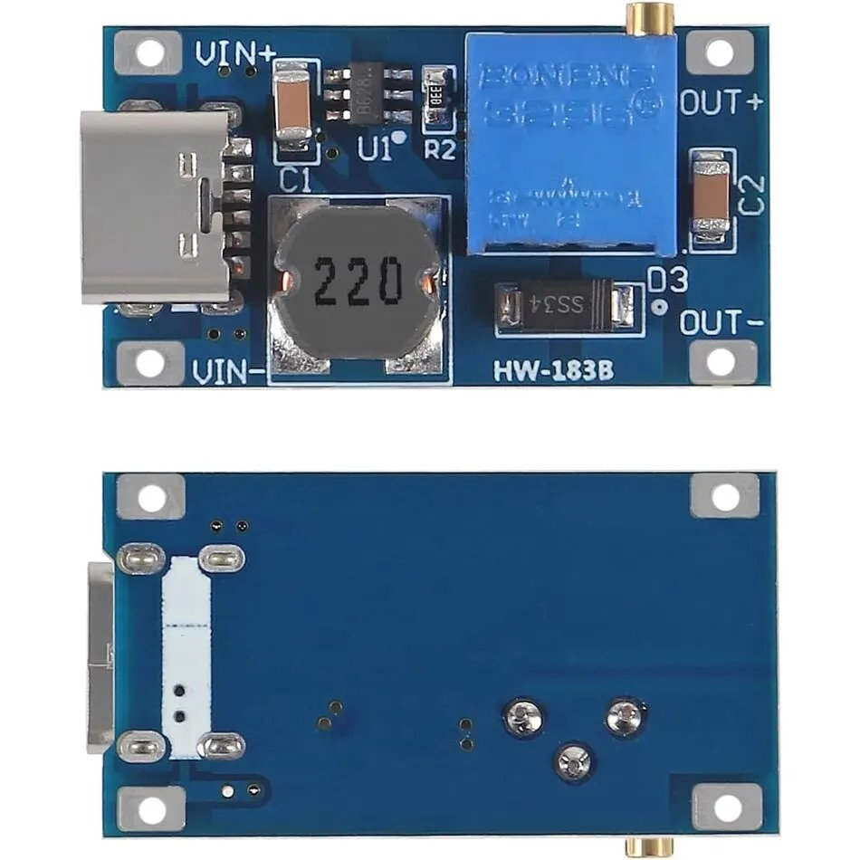
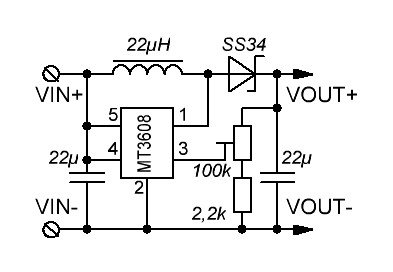

# MT3608 Step-Up Converter

The MT3608 is a high-efficiency, step-up (boost) DC-DC converter capable of delivering a regulated output voltage from a lower input voltage. It is designed for applications that require efficient voltage boosting in a compact form factor, making it ideal for battery-powered devices, portable electronics, and DIY projects.

## Specifications

- **Input Voltage Range**: 2.0V to 24V
- **Output Voltage Range**: 5.0V to 28V
- **Output Current**: Up to 2A
- **Conversion Efficiency**: Up to 93%
- **Switching Frequency**: 1.2MHz
- **Operating Temperature**: -40°C to 85°C
- **Size**: 36mm x 17mm x 14mm

## Features

- High efficiency over a wide load range
- Micro-USB input for easy connection
- Adjustable output voltage via precision potentiometer
- Integrated high-side MOSFET
- Low shutdown current
- Thermal shutdown and over-current protection

## Applications

- Battery-powered devices
- Portable electronics
- DIY projects
- Power supply for microcontrollers and other digital circuits
- LED drivers
- Solar-powered projects

## Pinout

1. **Input+**: Input voltage positive pin. Connect to the input power supply.
2. **Input-**: Input voltage negative pin. Connect to the input ground.
3. **Output+**: Output voltage positive pin. Connect to the output load.
4. **Output-**: Output voltage negative pin. Connect to the output ground.
5. **Micro-USB**: Alternative input voltage positive pin. Connect to a Micro-USB power source.

## Module Overview

- **Precision Potentiometer**: Rotate clockwise to increase the output voltage, counterclockwise to decrease the output voltage.
- **Warning**:
    - Do not reverse the positive and negative terminals to avoid damage.
    - Ensure adequate heat dissipation for high current applications.

## Usage Notes

- Ensure proper connection of input and output terminals.
- Adjust the potentiometer slowly to achieve the desired output voltage.
- Proper layout of the PCB is critical for minimizing noise and ensuring stable operation.
- Use low ESR capacitors for input and output to improve efficiency and reduce voltage ripple.
- 
## Schematic

## Documentation

-  [Datasheet](pdf/MT3608.pdf)
