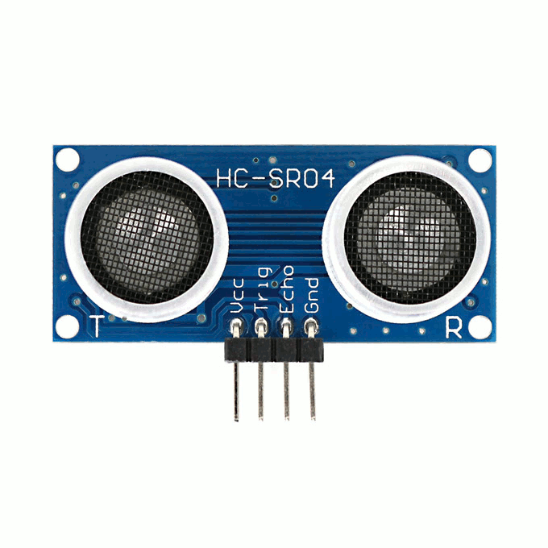
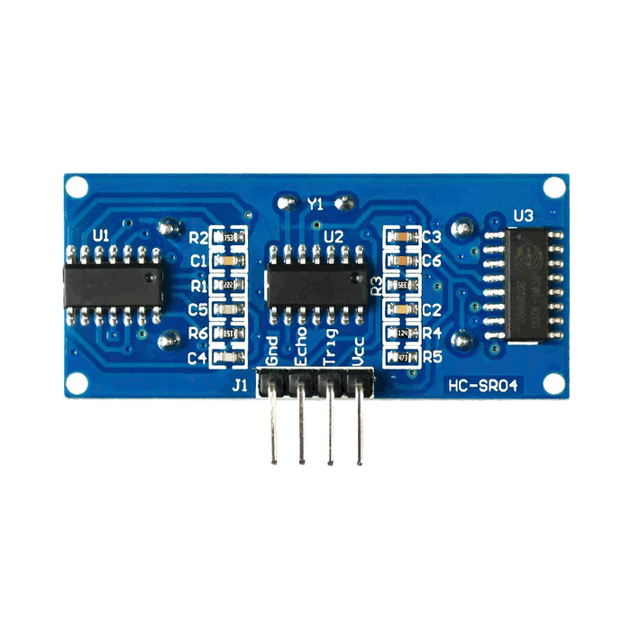

# HC-SR04 Sensor

The HC-SR04 sensor is an ultrasonic distance measuring sensor capable of accurately detecting distances within a certain range. Here's a detailed overview of the HC-SR04 sensor and its integration into your IoT projects:

## Description
The HC-SR04 sensor uses ultrasonic waves to measure distance, making it suitable for applications such as obstacle detection, object tracking, and proximity sensing.

## Technical Specifications
- Sensor Type: Ultrasonic Distance Sensor
- Operating Voltage: Typically 5V
- Operating Frequency: 40 kHz
- Measuring Range: 2 cm to 400 cm

## Features
- High accuracy in distance measurement.
- Wide operating voltage range for compatibility with various microcontrollers.
- Simple interfacing using trigger and echo pins.
- Non-contact measurement method for increased safety and reliability.

## Integration
Integrating the HC-SR04 sensor into your project is straightforward. Connect the VCC pin to the 5V power supply, GND pin to ground, TRIG pin to a digital output pin of the microcontroller, and ECHO pin to a digital input pin of the microcontroller. You can then use the provided Arduino library or implement your own logic to measure distances based on the pulse width of the ECHO signal.

## Projects
Explore examples of projects incorporating the HC-SR04 sensor for inspiration and guidance on how to utilize its capabilities in your own projects.

## Documentation Links
- [Datasheet](pdf/HCSR04.pdf)
