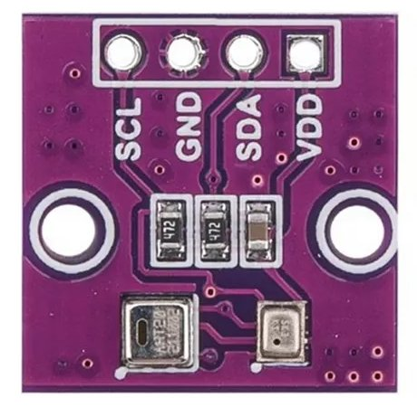
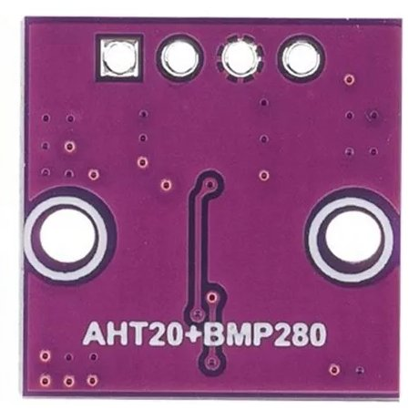
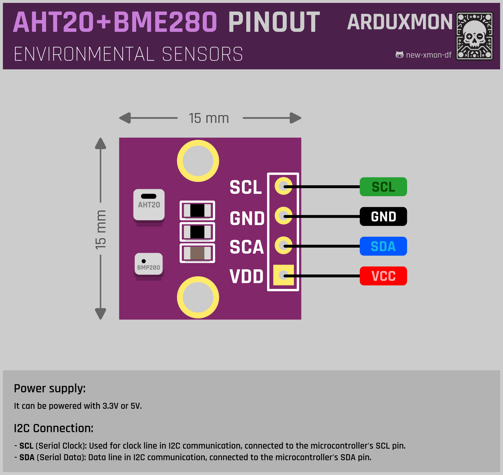

# AHT20 + BMP280 Module (Temperature, Humidity, and Pressure Sensor)

The AHT20 + BMP280 module combines the capability to measure temperature, humidity, and atmospheric pressure into a single device, offering a comprehensive solution for environmental monitoring in your IoT projects.


[](pictures/AHT20+BMP280-front.jpg)
[](pictures/AHT20+BMP280-back.jpg)


## Description
The AHT20 + BMP280 module provides accurate and reliable measurements of temperature, humidity, and atmospheric pressure, making it suitable for a wide range of applications, including weather stations, indoor air quality monitoring, and environmental monitoring systems.

## Technical Specifications
- Sensor Type: Environmental (Temperature, Humidity, Pressure)
- Interface: I2C
- Operating Voltage: Typically 3.3V or 5V

## Features
- Two-in-one environmental sensor for comprehensive data collection.
- High accuracy and stability for reliable measurements.
- Compact and easy-to-integrate design for various IoT applications.
- Low power consumption for energy-efficient operation.

## Pinout
[](schemas/AHT20-BMP280-Pinout.png)

## Integration
Integrating the AHT20 + BMP280 module into your project is straightforward, thanks to its compatibility with popular microcontrollers and development platforms. Simply connect the sensor to your microcontroller using the I2C or SPI interface and utilize the appropriate library to read data from the sensor.

## Using with ESPHome
The board can be easily integrated with ESPHome for use in Home Assistant. Here are the basic steps to get started:

```yaml
substitutions:
  # I2C
  i2c_address_aht20: "0x38"
  i2c_address_bmp280: "0x77"
  
i2c:
  - sda: GPIO35  
    scl: GPIO33
    scan: false
    frequency: 100kHz

sensor:
  - platform: aht10
    id: ${esp_id}_aht20
    variant: AHT20
    temperature:
      name: "${esp_name} AHT20 Temperature"
      id: ${esp_id}_aht20_temperature
    humidity:
      name: "${esp_name} AHT20 Humidity"
      id: ${esp_id}_aht20_humidity
    address: ${i2c_address_aht20}
    update_interval: never

  - platform: bmp280
    id: ${esp_id}_bmp280
    temperature:
      name: "${esp_name} BMP280 Temperature"
      id: ${esp_id}_bmp280_temperature
      oversampling: 16x
    pressure:
      name: "${esp_name} BMP280 Pressure"
      id: ${esp_id}_bmp280_pressure
    address: ${i2c_address_bmp280}
    update_interval: never

  - platform: absolute_humidity
    name: "${esp_name} Absolute Humidity"
    temperature: ${esp_id}_aht20_temperature
    humidity: ${esp_id}_aht20_humidity

  - platform: template
    id: ${esp_id}_average_temperature
    name: "${esp_name} Average Temperature"
    update_interval: never
    device_class: "temperature"
    state_class: "measurement"
    unit_of_measurement: "°C"
    accuracy_decimals: 1
    lambda: |-
      return (id(${esp_id}_aht20_temperature).state + id(${esp_id}_bmp280_temperature).state) / 2.0;

```

## DOWNLOAD FILES
Here I share the CAD program files.
- [**KICAD**](downloads/KICAD-AHT20+BMP280.zip): Files for KiCad 7, includes symbol, footprint, and 3D model.

## Documentation Links
- [AHT20 Datasheet](pdf/AHT20-datasheet.pdf)
- [BMP280 Datasheet](pdf/BMP280-datasheet.pdf)
