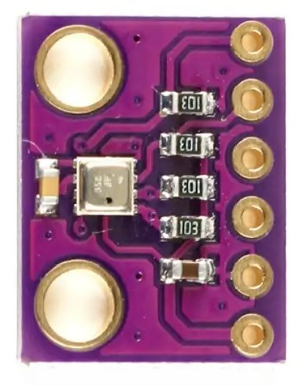
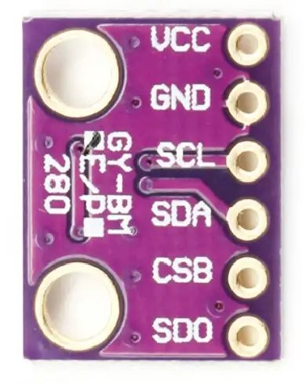
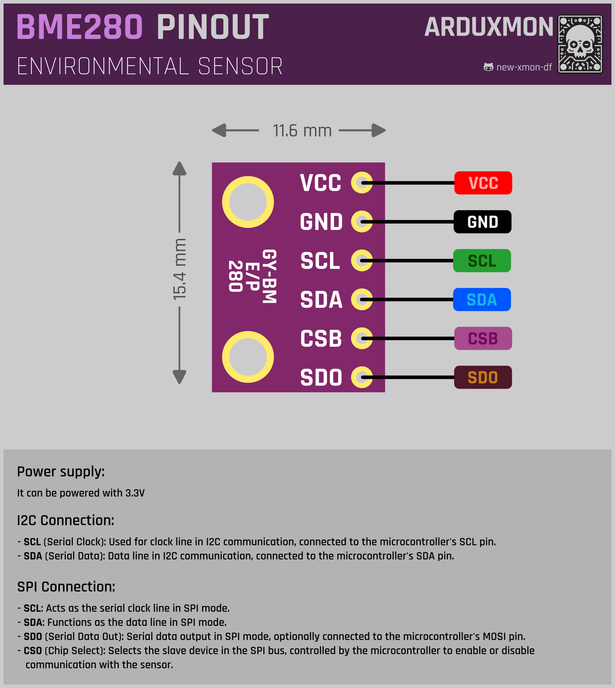

# BME280 3.3V Module (Environmental Sensor)

The BME280 sensor is a versatile environmental sensor capable of measuring temperature, humidity, and atmospheric pressure. Here's a detailed overview of the BME280 sensor and its integration into your IoT projects:

## Description
The BME280 sensor offers accurate and reliable environmental data sensing, making it suitable for a wide range of applications, including weather stations, indoor air quality monitoring, and environmental monitoring systems.

## Technical Specifications
- Sensor Type: Environmental (Temperature, Humidity, Pressure)
- Interface: I2C or SPI
- Operating Voltage: 3.3V
- Temperature Range: -40°C to +85°C
- Humidity Range: 0% to 100%
- Pressure Range: 300 hPa to 1100 hPa

## Features
- Three-in-one environmental sensor for comprehensive data collection.
- High accuracy and stability for reliable measurements.
- Compact and easy-to-integrate design for various IoT applications.
- Low power consumption for energy-efficient operation.

## Pinout

## Integration
Integrating the BME280 sensor into your project is straightforward, thanks to its compatibility with popular microcontrollers and development platforms. Simply connect the sensor to your microcontroller using the I2C or SPI interface and utilize the appropriate library to read data from the sensor.

## Documentation Links
- [Datasheet](pdf/BME280-datasheet.pdf)
