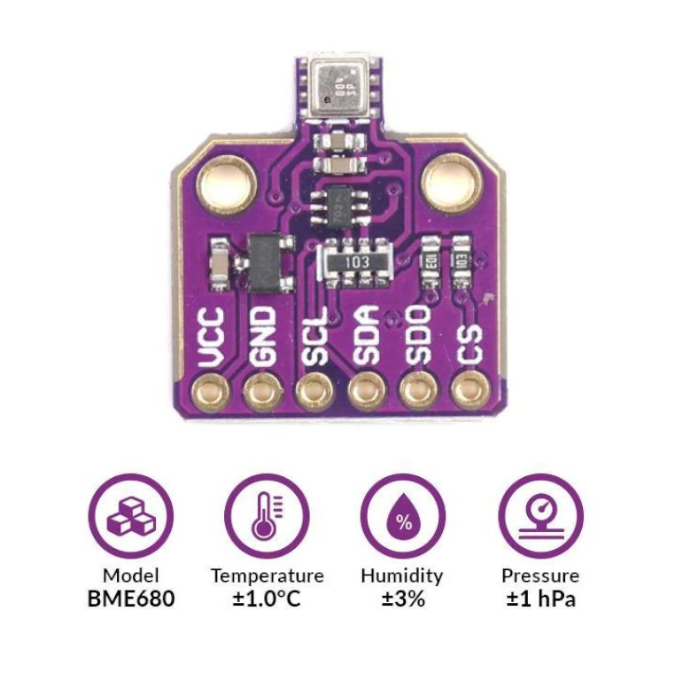
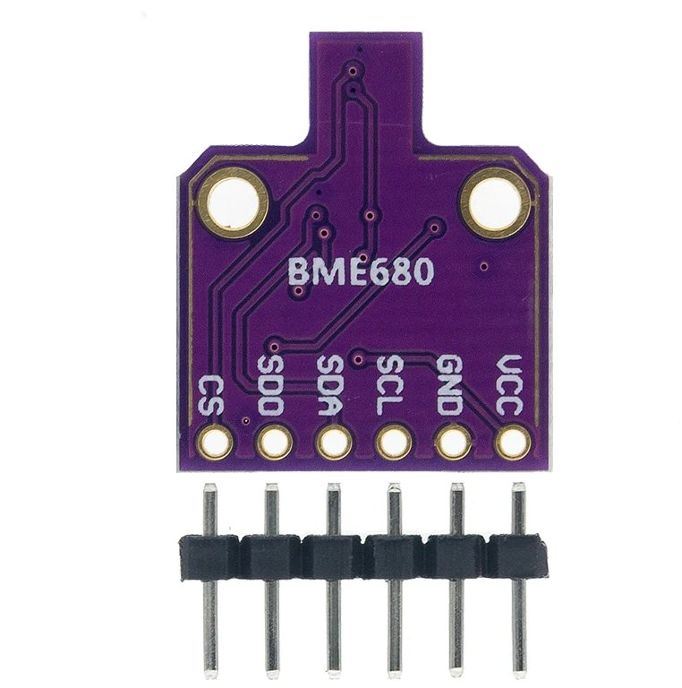
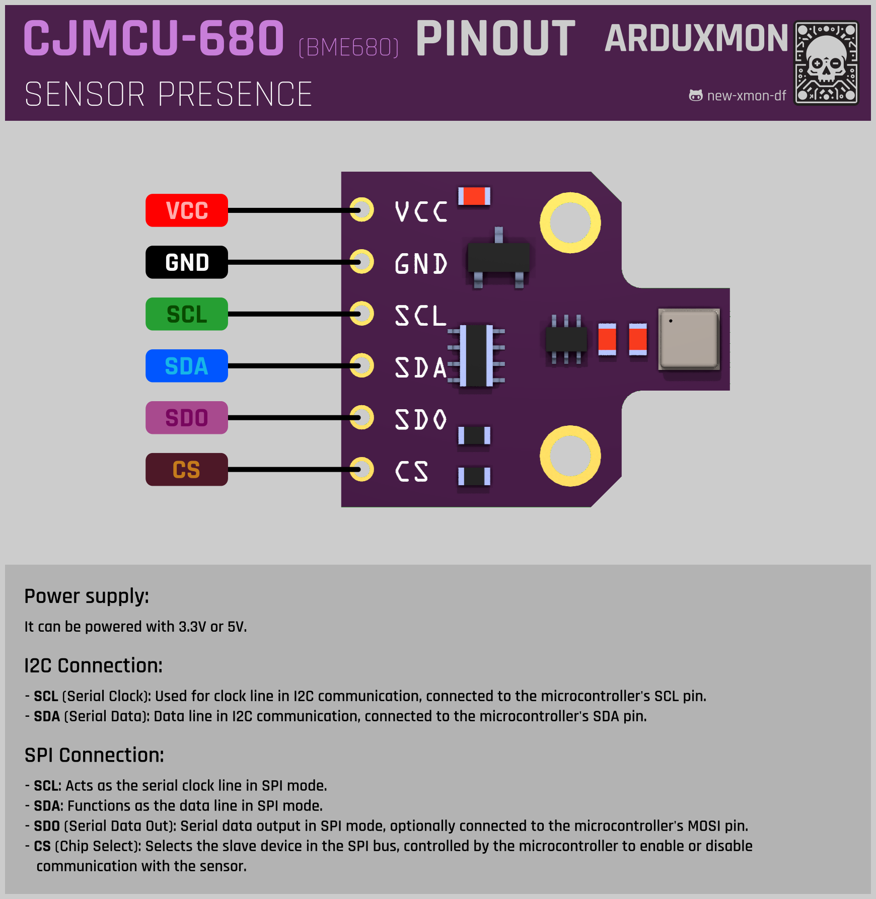

# BME680 Sensor

The BME680 sensor is a versatile environmental sensor capable of measuring temperature, humidity, pressure, and gas levels. Here's a detailed overview of the BME680 sensor and its integration into your IoT projects:

## Description
  The BME680 sensor offers accurate and reliable environmental data sensing, making it suitable for a wide range of applications, including weather stations, indoor air quality monitoring, and environmental monitoring systems.

## Technical Specifications
  - Sensor Type: Environmental (Temperature, Humidity, Pressure, Gas)
  - Interface: I2C or SPI
  - Operating Voltage: Typically 3.3V or 5V

## Features
  - Four-in-one environmental sensor for comprehensive data collection.
  - High accuracy and stability for reliable measurements.
  - Compact and easy-to-integrate design for various IoT applications.
  - Low power consumption for energy-efficient operation.

## Pinout

## Integration
  Integrating the BME680 sensor into your project is straightforward, thanks to its compatibility with popular microcontrollers and development platforms. Simply connect the sensor to your microcontroller using the I2C or SPI interface and utilize the appropriate library to read data from the sensor.

## Projects
  Explore examples of projects incorporating the BME680 sensor for inspiration and guidance on how to utilize its capabilities in your own projects.

## Documentation Links

- [Dimensiones](schemas/dimensiones-BME680.jpg)
- [Datasheet](pdf/BME680.pdf)
