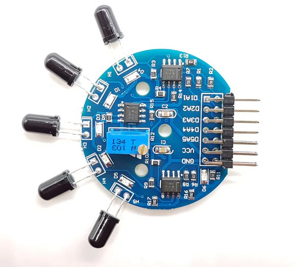
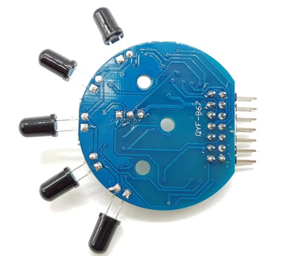

# Flame-M Five Channel Flame Detection Module

The Flame-M Five Channel Flame Detection Module is a robust and reliable solution for detecting flames over a wide range and with high precision. Here's a detailed overview of the Flame-M module and its integration into your IoT and safety projects:

## Description
The Flame-M module is designed with five flame sensors, providing a broad detection range of over 120°. It is capable of outputting both digital and analog signals, making it versatile for various applications. The module is ideal for environments requiring precise flame detection, such as industrial safety systems, fire alarm systems, and smart home applications.

## Technical Specifications
- **Detection Wavelength:** 700—1100 nm
- **Detection Distance:** Greater than 1.5m
- **Supply Voltage:** 3V-9V

## Features
- Five flame sensors for a wide detection range (greater than 120°).
- Outputs digital signals (high/low levels) for easy use.
- Outputs analog signals (voltage signals) for precise measurement, suitable for high-precision applications.
- All five outputs have status indicators for convenience during debugging and practical use.
- Adjustable detection distance for digital output and adjustable sensitivity for analog output, providing design flexibility.
- Uses 1% resistors for precise signal output, suitable for high-precision measurement needs.
- Equipped with three onboard M3 mounting holes for easy installation.
- Compatible with most microcontroller systems with 3.3V-9V power supply.
- All SMD components are soldered using SMT automated processes, ensuring military-grade quality and reliability.

## Pinout

| Pin | Description                                                                                                                                                                                |
|-----|--------------------------------------------------------------------------------------------------------------------------------------------------------------------------------------------|
| A1  | First flame sensor analog signal output port, the output voltage increases with the flame intensity (labeled as A2 on the module).                                                         |
| D1  | First flame sensor digital signal output port, high level indicates flame presence (indicator light on), low level indicates no flame (indicator light off) (labeled as D2 on the module). |
| A2  | Second flame sensor analog signal output port, the output voltage increases with the flame intensity.                                                                                      |
| D2  | Second flame sensor digital signal output port, high level indicates flame presence (indicator light on), low level indicates no flame (indicator light off).                              |
| A3  | Third flame sensor analog signal output port, the output voltage increases with the flame intensity.                                                                                       |
| D3  | Third flame sensor digital signal output port, high level indicates flame presence (indicator light on), low level indicates no flame (indicator light off).                               |
| A4  | Fourth flame sensor analog signal output port, the output voltage increases with the flame intensity.                                                                                      |
| D4  | Fourth flame sensor digital signal output port, high level indicates flame presence (indicator light on), low level indicates no flame (indicator light off).                              |
| A5  | Fifth flame sensor analog signal output port, the output voltage increases with the flame intensity.                                                                                       |
| D5  | Fifth flame sensor digital signal output port, high level indicates flame presence (indicator light on), low level indicates no flame (indicator light off).                               |
| VCC | Module power positive input port, input range 3.3V-9V.                                                                                                                                     |
| GND | Module power negative input port.                                                                                                                                                          |

## Integration
Integrating the Flame-M module into your project is straightforward, thanks to its compatibility with popular microcontrollers and development platforms. Simply connect the module to your microcontroller and adjust the detection distance and sensitivity as needed for your application.

## Projects
Explore examples of projects incorporating the Flame-M module for inspiration and guidance on how to utilize its capabilities in your own projects.

## Documentation Links

- [User manual](pdf/Flame-D-User-Manual.pdf)
- [Schematic](pdf/Flame-D-Schematic.pdf)
