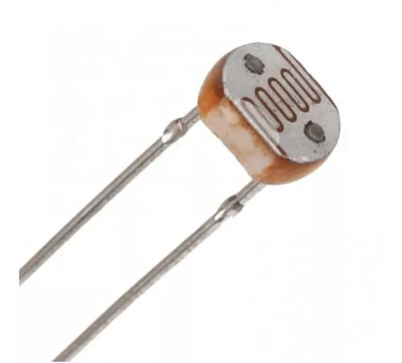

# LDR 5528 Sensor

The LDR 5528 sensor is a light-dependent resistor capable of detecting changes in light intensity. Here's a detailed overview of the LDR 5528 sensor and its integration into your IoT projects:

## Description
The LDR 5528 sensor is commonly used for light detection and ambient light monitoring in various applications, including automatic lighting systems, brightness control, and security systems.

## Technical Specifications
- Sensor Type: Light Dependent Resistor (LDR)
- Operating Voltage: Typically 3.3V or 5V

## Features
- Responsive to changes in light intensity for accurate light detection.
- Compact and easy-to-install design for versatile applications.
- Analog output for interfacing with microcontrollers and analog-to-digital converters (ADCs).

## Integration
Integrating the LDR 5528 sensor into your project is simple. Connect one terminal of the LDR to the microcontroller's analog input pin and the other terminal to ground. Additionally, connect a pull-down resistor, typically with a value of around 10k ohms, between the analog input pin and ground to ensure stable readings. You can then read the analog voltage output from the sensor and interpret it as a measure of light intensity.

## Projects

## Documentation Links
- [Datasheet](pdf/SEN-09088.pdf)
