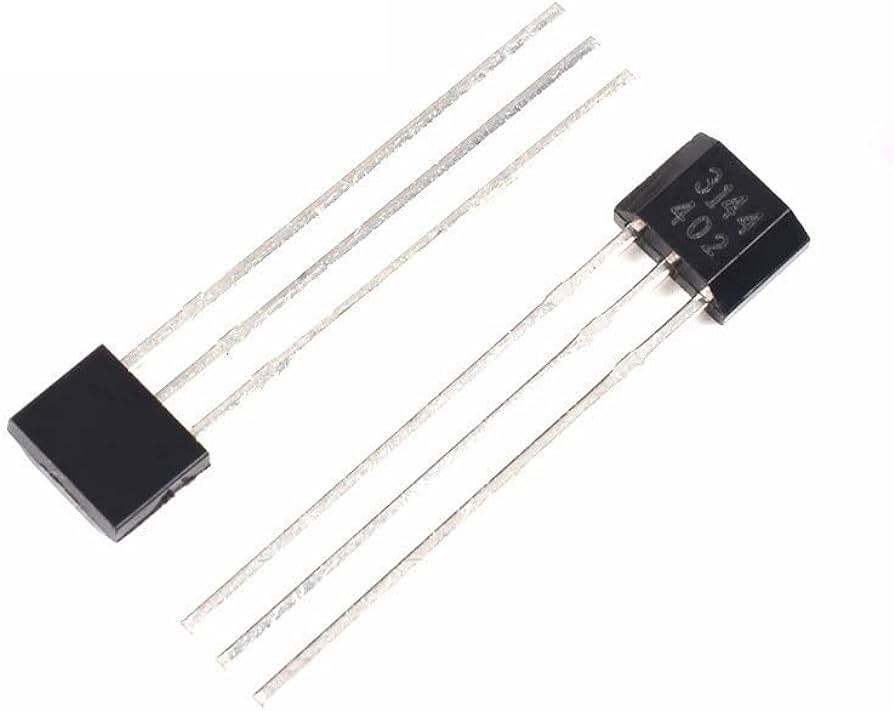

# A3144E Hall Effect Sensor

The A3144E Hall Effect sensor is a versatile device commonly used for proximity sensing, positioning, speed detection, and current sensing applications. Here's an overview of the A3144E sensor and its integration into your electronic projects:

## Description
The A3144E sensor is a Hall Effect sensor capable of detecting changes in magnetic fields. It utilizes the Hall Effect to output a voltage proportional to the magnetic field intensity. This sensor is often employed in applications such as motor control, proximity switches, and non-contact switching operations.

## Technical Specifications
- Sensor Type: Hall Effect Sensor
- Operating Voltage: Typically 4.5V to 24V
- Output Voltage: Analog or Digital (TTL)

## Features
- High sensitivity to magnetic fields for precise detection.
- Robust construction suitable for industrial and automotive applications.
- Wide operating voltage range for flexibility in various circuits.

## Integration
Integrating the A3144E sensor into your project is straightforward. Connect the sensor's supply pin to a stable voltage source within its operating range (typically between 4.5V and 24V). Connect the sensor's ground pin to the common ground of your circuit. The output pin of the sensor provides either an analog or digital (TTL) signal, depending on the version used. For analog output, connect the sensor's output pin directly to the microcontroller's analog input pin. For digital output, connect the output pin to a digital input pin of the microcontroller.

## Projects
- **Magnetic Proximity Switch**: Create a magnetic proximity switch using the A3144E sensor to detect the presence of a magnet and trigger an action, such as turning on a light or activating a relay.
- **Speed Detection**: Utilize the A3144E sensor in conjunction with a magnet attached to a rotating shaft to measure the speed of rotation in RPM (Revolutions Per Minute).
- **Current Sensing**: Implement current sensing in a circuit by utilizing the magnetic field produced by the current flow and measuring it with the A3144E sensor.

## Documentation Links
- [Datasheet](pdf/A3141-2-3-4-Datasheet.pdf)
