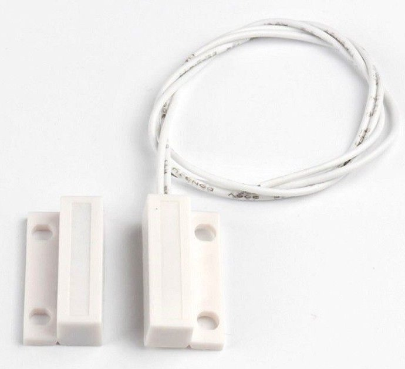
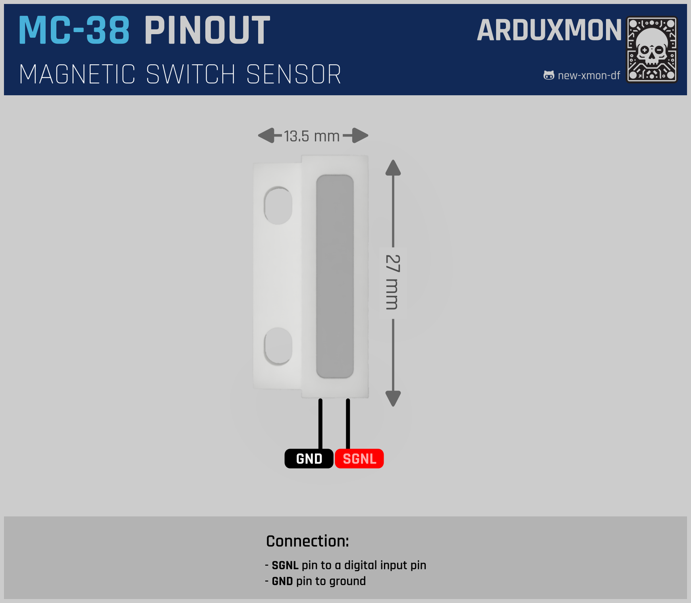

# MC-38 Wired Sensor Magnetic Switch

[](pictures/MC-38.jpg)

## Description

The MC-38 Wired Door Window Sensor Magnetic Switch is a simple and reliable device used to detect the opening and
closing of doors and windows. It consists of a magnetic switch and a magnet. When the magnet is moved away from the
switch, the circuit opens, triggering an alert or action in your security system.

## Features

- **Simple Installation**: Easy to mount on doors or windows with screws or adhesive.
- **Reliable Detection**: Provides consistent performance for detecting door/window status.
- **Normally Closed (NC) Operation**: Circuit opens when the magnet is moved away.
- **Compact Size**: Fits discreetly on most doors and windows.
- **Long Cable**: Flexible installation options with a long wire.

## Technical Specifications

- **Switch Type**: Normally Closed (NC)
- **Operating Distance**: 15-25mm
- **Cable Length**: 30cm (12 inches)
- **Switch Dimensions**: 28 x 14 x 8mm (1.10 x 0.55 x 0.31 inches)
- **Magnet Dimensions**: 28 x 14 x 8mm (1.10 x 0.55 x 0.31 inches)
- **Material**: ABS Plastic
- **Max Current**: 100mA
- **Max Voltage**: 100V DC

## How it Works

The MC-38 sensor operates on a simple magnetic principle. The switch contains a reed switch that is normally closed (
connected) when the magnet is within a certain range. When the door or window opens, the magnet moves away from the
switch, causing the reed switch to open the circuit. This change in state can be detected by a microcontroller or
security system to trigger an alarm or notification.

## Usage Instructions

### Installation

1. **Mounting the Sensor**: Attach the magnetic switch to the fixed frame of the door or window using screws or adhesive
   tape.
2. **Mounting the Magnet**: Place the magnet on the moving part (door or window) aligned with the sensor.
3. **Wiring**: Connect the two wires from the sensor to the appropriate input terminals on your security system or
   microcontroller.

### Wiring to Microcontroller

- **Connect one wire** to a digital input pin on the microcontroller.
- **Connect the other wire** to ground (GND).
- **Optional**: Use a pull-up resistor if required by your microcontroller.

## ESPHome Configuration

The MC-38 sensor can be easily integrated into Home Assistant using ESPHome. Below is a sample configuration for
ESPHome.

```yaml
# ...

binary_sensor:
  - platform: gpio
    pin:
      number: GPIO14
      mode: INPUT_PULLUP
    name: "Door Sensor"
    device_class: door

# ...
```

### Explanation

- **binary_sensor**: Configures the MC-38 sensor as a binary sensor.
- **pin**: Specifies the GPIO pin connected to the sensor.
- **name**: Assigns a name for Home Assistant integration.
- **device_class**: Sets the type of sensor, in this case, a door sensor.

## Pinout

[](schemas/MC-38-Pinout.png)

## Documentation Links

- [Datasheet](pdf/MC38-Datasheet.pdf)
