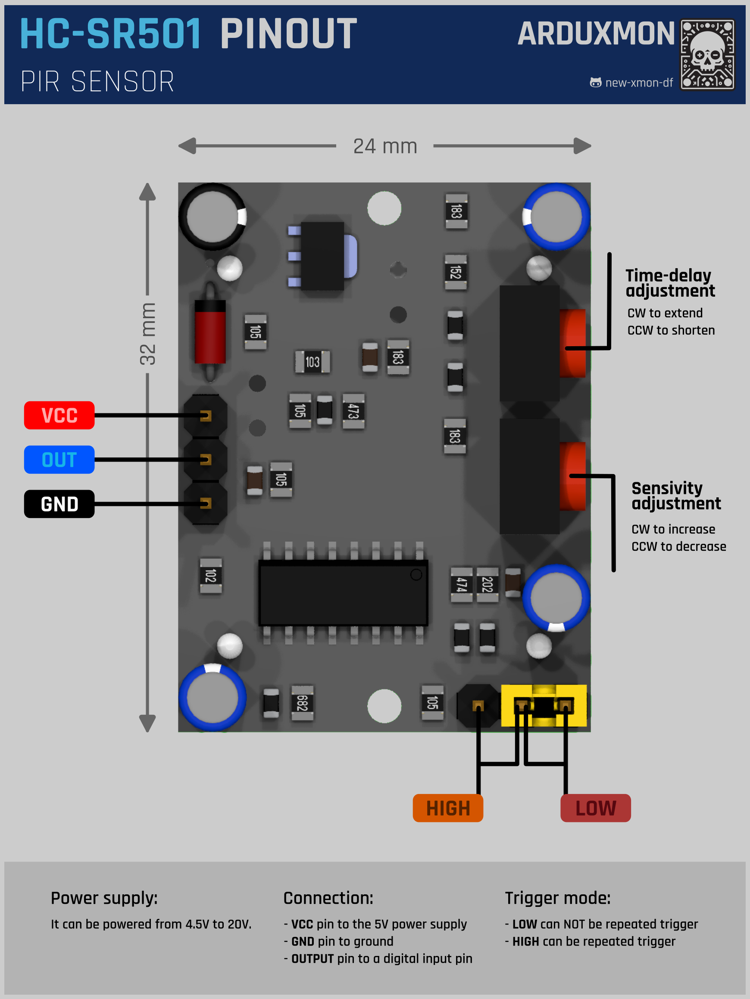

# HC-SR501 PIR MOTION DETECTOR

## Product Description

The HC-SR501 PIR Motion Detector is based on infrared technology, featuring an automatic control module designed with a
high-sensitivity LHI778 probe imported from Germany. It operates at ultra-low voltage and is widely used in various
auto-sensing electrical equipment, especially in battery-powered automatic controlled products.

## Specifications

- **Voltage:** 5V – 20V
- **Power Consumption:** 65mA
- **TTL Output:** 3.3V, 0V
- **Delay Time:** Adjustable (0.3->5min)
- **Lock Time:** 0.2 sec
- **Trigger Methods:** L – disable repeat trigger, H enable repeat trigger
- **Sensing Range:** < 120 degrees, within 7 meters
- **Temperature:** -15°C ~ +70°C
- **Dimension:** 32*24 mm, distance between screws 28mm, M2, Lens diameter: 23mm

## Application

Automatically senses motion for various applications including floor, bathroom, basement, porch, warehouse, garage,
ventilator, alarm, etc.

## Features

- Automatic induction with adjustable delay.
- Photosensitive control (optional).
- Temperature compensation for performance adjustment.
- Two trigger modes: non-repeatable and repeatable.
- Induction blocking time to prevent interference.
- Wide operating voltage range and low power consumption.
- High output signal compatibility with various circuits.

## Pinout

## Adjustment

- Distance and delay adjustment through potentiometers.

## Instructions for Use

- Initialization period of about a minute after power-up.
- Avoid direct exposure to lighting sources and wind to prevent interference.
- Dual-probe design for sensitivity to human movement.
- Install the module in the direction of most human activities for optimal performance.
- Circular lens design for increased induction range.

## Application Scope

- Security products
- Body induction toys
- Body induction lamps
- Industrial automation control, etc.

The HC-SR501 PIR Motion Detector is widely utilized in enterprises, hotels, stores, corridors, and other sensitive areas
for automatic light control, lighting, and alarm systems.

## Sensitivity Adjustment

The PIR sensor features a potentiometer at the back to adjust sensitivity.

This potentiometer sets the maximum detection range. Sensitivity can be adjusted within a range of approximately 3
meters to 7 meters (9 to 21 feet). However, the layout of your room may affect the actual range you achieve. Turning the
potentiometer clockwise will increase sensitivity and thus the range, while turning it counterclockwise will decrease
sensitivity.

## Time Delay Adjustment

There's another potentiometer at the back of the PIR sensor to adjust time delay.

This potentiometer sets how long the output will remain HIGH after motion is detected. It can be adjusted from 1 second
to approximately 3 minutes. Turning the potentiometer clockwise increases the delay, whereas turning it counterclockwise
decreases the delay.

## DOWNLOAD FILES

Here I share the CAD program files.

- [**KICAD**](downloads/KICAD-HC-SR501.zip): Files for KiCad 6, includes symbol, footprint and 3D.

## Documentation Links

- [Datasheet](pdf/HC-SR501-datasheet.pdf) - [ES](pdf/HC-SR501-datasheet-ES.pdf)