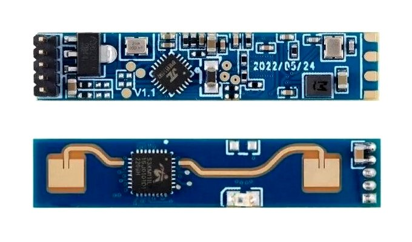

# LD2410B Human Presence Sensing Module

The LD2410B is a high-sensitivity 24GHz human presence status sensing module developed by Hilink Electronics. It utilizes Frequency-Modulated Continuous Wave (FMCW) technology to detect human targets within a set space. Combined with radar signal processing and accurate human body sensing algorithms, it achieves high-sensitivity human presence status sensing, capable of identifying human bodies in motion and stationary states. Auxiliary information such as the distance of the target can be calculated. This product is primarily used in indoor environments to sense the presence of moving or micro-moving human bodies and output real-time detection results. The farthest sensing distance can reach 5 meters, with a distance resolution of 0.75m. It provides a visual configuration tool for easily configuring sensing parameters to adapt to specific application needs. The LD2410B supports GPIO and UART output, making it plug-and-play and flexible for various smart scenarios and terminal products.

## Product Features and Benefits

### Features:
- Plug and play, easy assembly
- Longest sensing distance up to 5 meters
- Large detection angle, coverage up to ±60 degrees
- Accurate identification within the interval, support division of sensing range and interference shielding
- Multi-level intelligent parameter adjustment via Bluetooth or serial port
- Visual debugging and configuration tools
- Small and simple, minimum size only 7mmx35mm
- Supports various installation methods such as ceiling hanging and wall hanging
- 24GHz ISM band, compliant with FCC and CE spectrum regulations
- Cost-effective choice

### Solution Advantage:
The LD2410B human body sensing module adopts 24GHz millimeter wave radar sensor technology, offering several advantages over other solutions in human body sensing applications.

## Application Scenarios

The LD2410B human body sensing module can detect and identify human bodies in motion, fretting, standing, sitting, and lying down. It supports multi-level parameter adjustment and can be widely used in various AIoT scenarios. Common application scenarios include:

- Human body sensor light control
- Human body induction wake-up of advertising screens and other equipment
- Life safety protection
- Smart home appliances
- Intelligent security

## Hardware Description

Module size: 7mmx35mm, with 5 pin holes reserved in the hardware (factory default does not match the pins).
The pin hole diameter is 0.6mm, and the pin spacing is 1.27mm.

## Pin Definition:

| Pin | Symbol | Name          | Function                                      |
| --- | ------ | ------------- | --------------------------------------------- |
| 1   | OUT    | Target Status | Human presence detected: output high level No human presence: output low level |
| 2   | UART_Tx| Serial Tx     | Serial Tx pin                                 |
| 3   | UART_Rx| Serial Rx     | Serial Rx pin                                 |
| 4   | GND    | Power Ground  | Power ground                                  |
| 5   | VCC    | Power Input   | Power input 5V                                |

## Documentation Links

- [Datasheet](pdf/HLK-LD2410B-V1.04.pdf)
