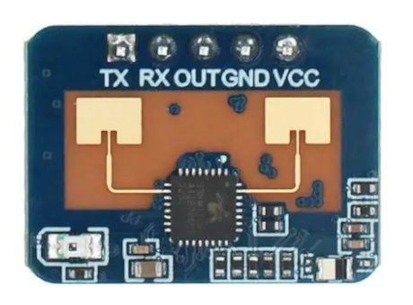
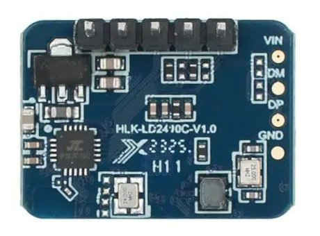
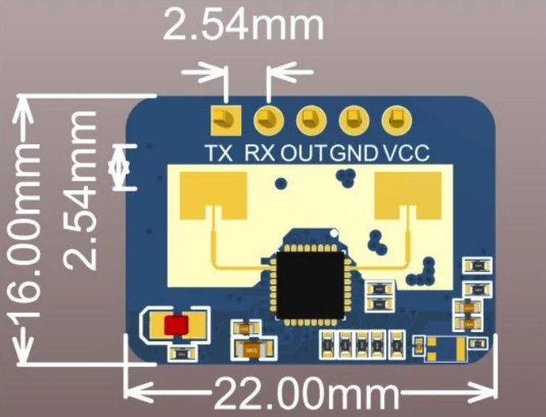

# LD2410C Human Presence Sensing Module

The LD2410C is an advanced 24GHz human presence status sensing module manufactured by Hilink Electronics. Employing Frequency-Modulated Continuous Wave (FMCW) technology, this module is designed to detect human targets within a specified area. With its radar signal processing and precise human body sensing algorithms, it achieves highly sensitive human presence detection, capable of identifying both moving and stationary human bodies. Additionally, it provides auxiliary information such as target distance calculation. This product is primarily utilized in indoor environments for real-time detection of moving or micro-moving human bodies. It offers a maximum sensing distance of up to 5 meters and a distance resolution of 0.75m. Moreover, it features a visual configuration tool for convenient adjustment of sensing parameters to suit specific application requirements. The LD2410C supports GPIO and UART output, ensuring plug-and-play compatibility and flexibility for a wide range of smart scenarios and terminal products.

## Product Features and Advantages

### Features:
- Easy plug-and-play installation
- Maximum sensing distance of 5 meters
- Wide detection angle, coverage up to ±60 degrees
- Accurate identification within the designated interval, with support for range division and interference shielding
- Multi-level intelligent parameter adjustment via Bluetooth or serial port
- Visual debugging and configuration tools
- Compact design, with minimum dimensions of 7mmx35mm
- Supports various installation methods such as ceiling and wall mounting
- Operates on the 24GHz ISM band, compliant with FCC and CE spectrum regulations
- Cost-effective solution

### Solution Advantages:
The LD2410C human body sensing module, utilizing 24GHz millimeter wave radar sensor technology, offers several advantages over alternative solutions in human body sensing applications.

## Application Scenarios

The LD2410C human body sensing module is suitable for detecting and identifying human bodies in various states, including motion, fretting, standing, sitting, and lying down. It supports multi-level parameter adjustment and finds application in a wide range of AIoT scenarios. Common applications include:

- Human body sensor light control
- Human body induction for activating advertising screens and other equipment
- Life safety protection systems
- Smart home appliances
- Intelligent security systems

## Hardware Description

Module dimensions: 7mmx35mm, featuring 5 pin holes reserved in the hardware (factory default does not match the pins). The pin hole diameter is 0.6mm, with a pin spacing of 1.27mm.

## Pin Definition:

| Pin | Symbol | Name          | Function                                      |
| --- | ------ | ------------- | --------------------------------------------- |
| 1   | OUT    | Target Status | High output: Human presence detected Low output: No human presence detected |
| 2   | UART_Tx| Serial Tx     | Transmitting pin for serial communication     |
| 3   | UART_Rx| Serial Rx     | Receiving pin for serial communication        |
| 4   | GND    | Power Ground  | Ground connection for power supply             |
| 5   | VCC    | Power Input   | 5V power input                                 |

## Documentation Links

- [Datasheet](pdf/HLK-LD2410C_datasheet.pdf)

---
This README.md provides detailed information about the LD2410C Human Presence Sensing Module, including its features, application scenarios, hardware description, pin definition, and relevant documentation links.
