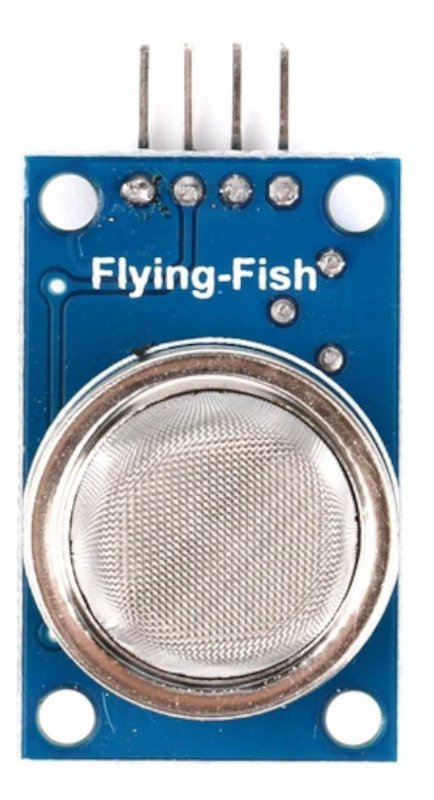
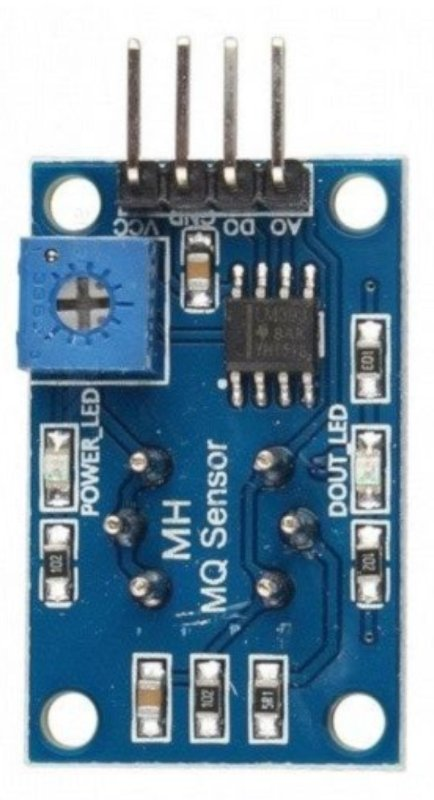
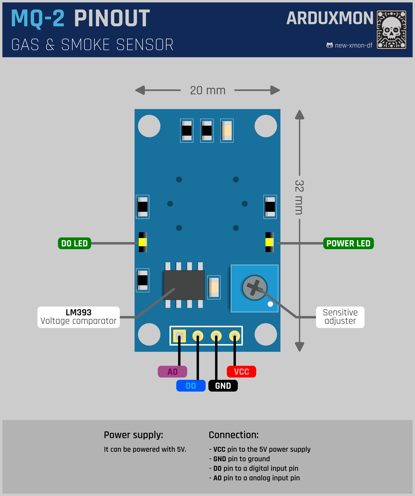

# MQ-2 Gas Sensor Module

## Description

The MQ-2 Gas Sensor Module is a versatile device designed to detect various gases and smoke in the air. It is commonly
used in safety and automation systems to monitor the presence of combustible gases and react accordingly. The sensor
utilizes a sensitive element that changes its resistance in the presence of target gases, enabling the detection of gas
concentrations.

[](pictures/MQ-2-front.jpg)
[](pictures/MQ-2-back.jpg)

## Features

- **Wide Range Detection**: Capable of detecting a variety of gases including methane, propane, hydrogen, alcohol, and
  smoke.
- **High Sensitivity**: Provides accurate and reliable detection of target gases.
- **Analog and Digital Output**: Offers both analog and digital outputs for flexible integration with microcontrollers
  and systems.
- **Fast Response Time**: Quickly responds to changes in gas concentration for timely alerts and actions.
- **Simple Interface**: Easy to connect and use with standard electronic components.

## Technical Specifications

- **Operating Voltage**: 5V DC
- **Operating Current**: <150mA
- **Sensitivity**: Adjustable via onboard potentiometer
- **Detection Range**: 300 - 10,000 ppm (parts per million) for most gases
- **Heater Resistance**: 33Ω ± 5% at 25°C
- **Load Resistance**: 200KΩ
- **Heater Voltage**: 5.0V ± 0.2V
- **Heater Power Consumption**: <900mW
- **Dimensions**: 32 x 20 x 22mm
- **Weight**: 5g

## How it Works

The MQ-2 sensor operates based on the principle of gas conductivity. It contains a tin dioxide (SnO2) sensing element
that changes its resistance when exposed to target gases. The sensor's internal heater heats up the sensing element,
making it more sensitive to gas molecules. When the target gas is present, it reacts with the sensing element, causing a
change in resistance. This change is measured and translated into gas concentration levels.

## Usage Instructions

### Installation

1. **Mounting the Sensor**: Securely mount the MQ-2 module in a location where gas detection is required.
2. **Wiring**: Connect the sensor to your microcontroller or system using jumper wires.
3. **Calibration**: Optionally, calibrate the sensor by adjusting the potentiometer to achieve optimal sensitivity for
   the target gas.

### Wiring to Microcontroller

- **Connect VCC**: to a 5V pin on the microcontroller.
- **Connect GND**: to the ground (GND) pin on the microcontroller.
- **Connect DOUT (Digital Output)**: to a digital input pin for digital output (optional).
- **Connect AOUT (Analog Output)**: to an analog input pin for analog output (optional).

## ESPHome Configuration

The MQ-2 sensor can be seamlessly integrated into Home Assistant using ESPHome. Below is a sample configuration for
ESPHome.

```yaml
# ...

sensor:
  - platform: adc
    pin: A0
    name: "Gas Sensor"
    unit_of_measurement: "ppm"
    filters:
      - calibrate_linear:
          - 0.0 -> 0
          - 3.3 -> 10000

# ...

```

### Explanation

* **sensor**: Configures the MQ-2 sensor as an analog sensor.
* **pin**: Specifies the analog pin connected to the sensor.
* **name**: Assigns a name for Home Assistant integration.
* **unit_of_measurement**: Sets the unit of measurement for gas concentration.
* **filters**: Calibrates the sensor output to correspond to gas concentration levels.

## Pinout

[](schemas/MQ-2-Pinout.png)

## Documentation Links

- [Datasheet](pdf/mq-2-datasheet.pdf)
