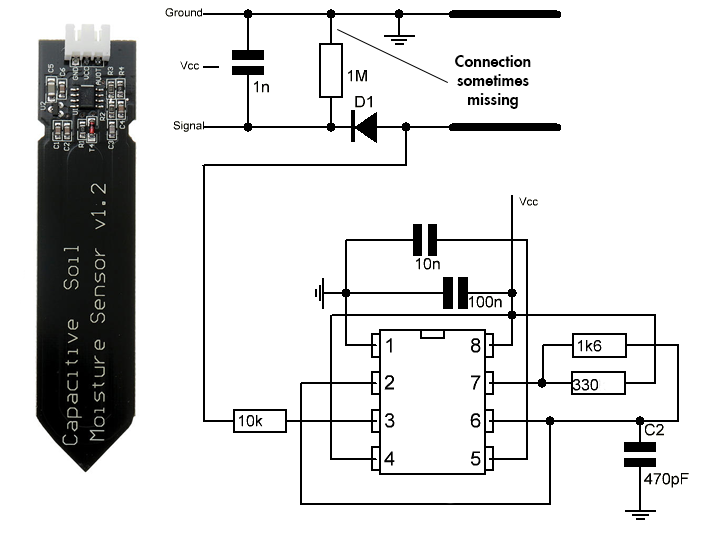

# Soil Moisture Sensor (Capacitive)
This soil moisture sensor utilizes a capacitance-based detection method to measure soil moisture levels, as opposed to resistive sensing used in other types of moisture sensors.

## Description
The soil moisture sensor is made of a corrosion-resistant material, providing it with a long service life. By inserting it into the soil, you can obtain real-time moisture data, making it ideal for gardening and smart agriculture applications.

## Features
- 3-pin Gravity Sensor interface.
- Analog output.
- Operating voltage range: 3.3 ~ 5.5V.
- Compact size: 99.2x22.3x7.4mm.

## Applications
- Garden plants.
- Moisture detection.
- Smart agriculture.

## Technical Specifications
- Operating Voltage: DC 3.3-5.5V
- Output Voltage: DC 0-3.0V
- Interface: PH2.0-3P
- Size: 99.2x22.3x7.4mm

## Integration
This sensor uses a 3-pin Gravity Sensor interface, allowing for easy direct connection to the Gravity I/O expansion shield. You can use the sensor's analog output to integrate it with your favorite microcontroller and obtain soil moisture readings.

## Schema

## Documentation Links
- [Schema](pictures/Capacitive_Soil_Moisture.jpg)
