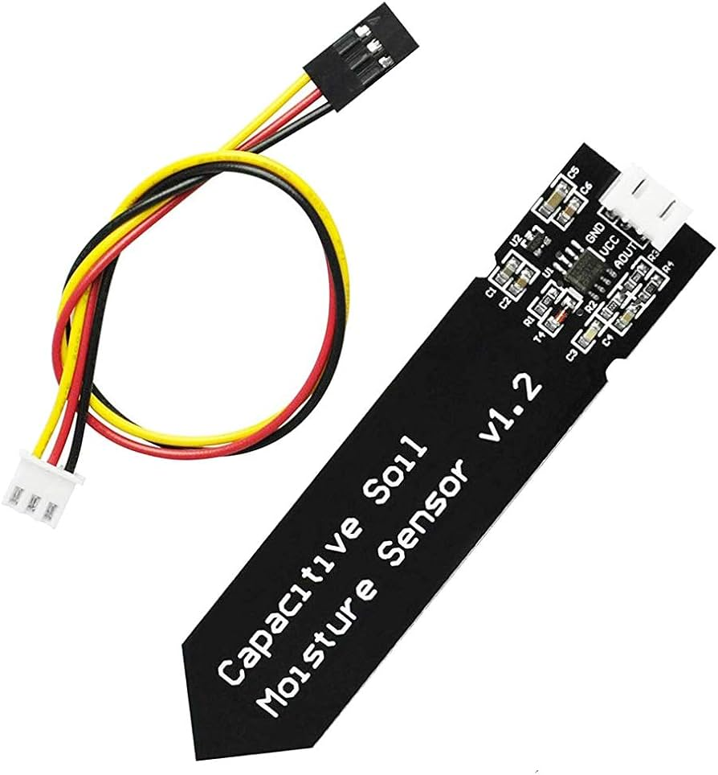
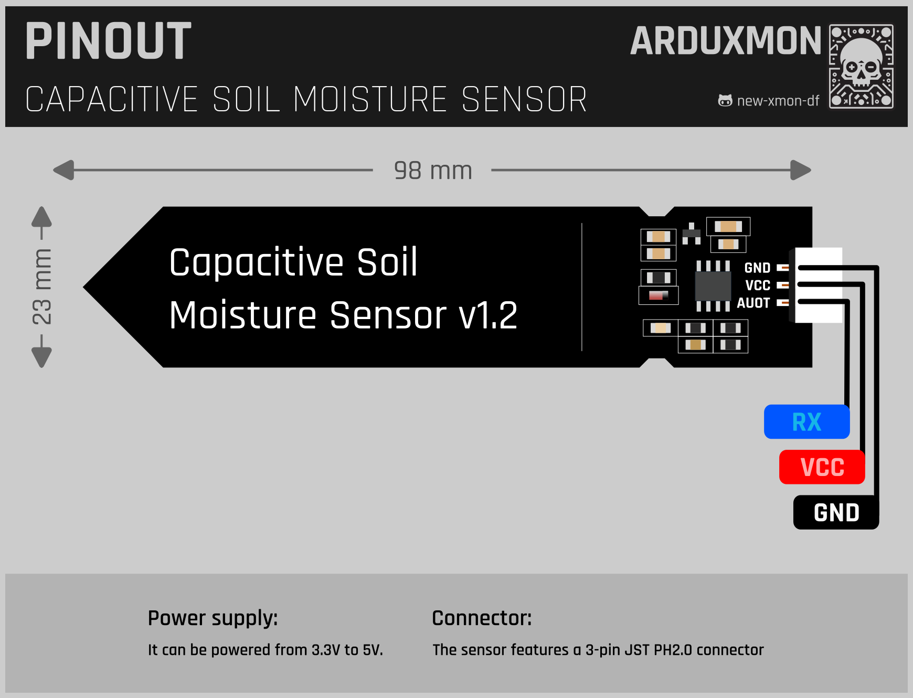

# Capacitive Soil Moisture Sensor

## Description

The Capacitive Soil Moisture Sensor is an innovative device designed for accurately monitoring soil moisture levels in
gardening and agricultural applications. Unlike traditional resistive-style sensors, this capacitive sensor offers
superior accuracy, durability, and ease of use.

## Features

- Single-probe design: No exposed metal to rust.
- Capacitive measurement: Provides precise soil moisture readings.
- Wide operating voltage range: Compatible with 3.3V to 5.5V microcontrollers.
- Low power consumption: Consumes less than 5mA of current.
- Compact size: PCB dimensions of 98 x 23mm (3.86 x 0.91 inches).
- JST PH2.0-3P connector: Easy to connect to microcontrollers.

## Advantages over Resistive Sensors

Traditional resistive-style soil moisture sensors often suffer from rusting over time, affecting their accuracy and
reliability. In contrast, the capacitive soil moisture sensor utilizes a capacitance-based measurement method, offering
several advantages:

- **No rusting**: With only one probe and no exposed metal, this sensor is resistant to rust, ensuring long-term
  accuracy and reliability.
- **Improved accuracy**: Capacitive measurement provides more accurate soil moisture readings compared to resistive
  sensors, even in loose soil conditions.
- **Minimal impact on plants**: Unlike resistive sensors, capacitive sensors do not introduce electricity into the soil,
  minimizing the risk of damage to plants.
- **Wide operating voltage range**: Compatible with a wide range of microcontrollers, making it versatile for various
  projects.

## Technical Specifications

- **Operating Voltage**: 3.3V to 5.5V
- **Operating Current**: < 5mA
- **Output Voltage at 5V**: 1.5V to 3V (approx.)
- **Sensor Probe Dimensions (PCB)**: 98 x 23mm (3.86 x 0.91 inches)
- **Cable Length**: 20cm (8 inches)

## How it Works

The Capacitive Soil Moisture Sensor operates by measuring the capacitance between two PCB traces, which varies based on
the moisture content of the surrounding soil. As the soil becomes wetter, the capacitance increases, resulting in a
slower charging time. Conversely, dry soil has lower capacitance and charges more quickly. This capacitance change is
detected and converted into an analog voltage output, proportional to the soil moisture level.

## Usage Instructions

- **Probe Placement**: Ensure the probe is inserted into the soil at an appropriate depth, avoiding crossing the limit
  line on the sensor.
- **Avoid Water Contact**: The sensor components are not waterproof, so avoid direct contact with water or splashes.
  Consider using heat shrink tubing or applying a protective coating for added durability.
- **Threshold Values**: Determine threshold values for soil moisture levels by recording sensor outputs under different
  conditions, such as dry soil, ideal moisture, and excessive moisture.

## Finding Threshold Values

Determining the exact percentage of moisture in the soil directly from the sensor measurements is not feasible. However,
it's relatively straightforward to establish basic ranges indicating whether the soil is too dry, too wet, or just right
for plant growth.

To do this, follow these steps:

1. **Conduct Sensor Readings**: Run the provided sketch and record sensor output readings under three key conditions:

    - When the soil is sufficiently dry that the plant requires watering.
    - When the soil has reached its optimal moisture level for the plant.
    - When the soil is heavily watered and becomes excessively wet, which is not ideal for the plant's health.

2. **Recorded Readings**:

    - **In open air**: Typically around 590.
    - **Dry soil needing watering**: Approximately 380.
    - **Ideal soil moisture**: Falls within the range of 277 to 380.
    - **Soil just watered**: Approximately 277.
    - **In a cup of water**: Around 273.

It's important to note that this process may involve some trial and error to achieve accurate readings. Once you've
obtained the readings, you can use them as threshold values to trigger appropriate actions, such as watering or
adjusting environmental conditions for optimal plant growth.

## Integration

The sensor features a 3-pin JST PH2.0 connector for easy integration with microcontrollers. The analog voltage output
can be read using an analog input pin on your microcontroller, allowing for real-time monitoring and automated watering
systems.

## Pinout

## Documentation Links

- [Schema](schemas/Capacitive-Soil-Moisture-schema.png)
