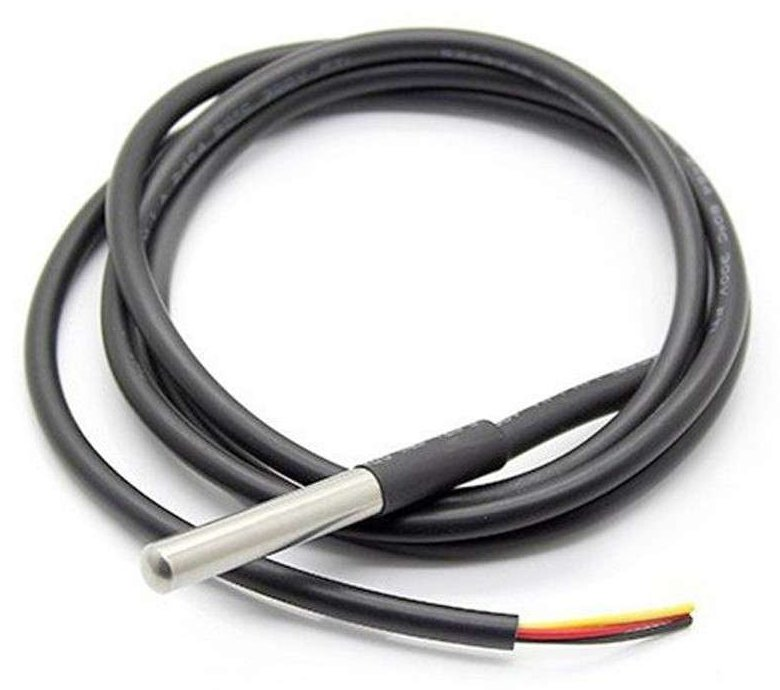
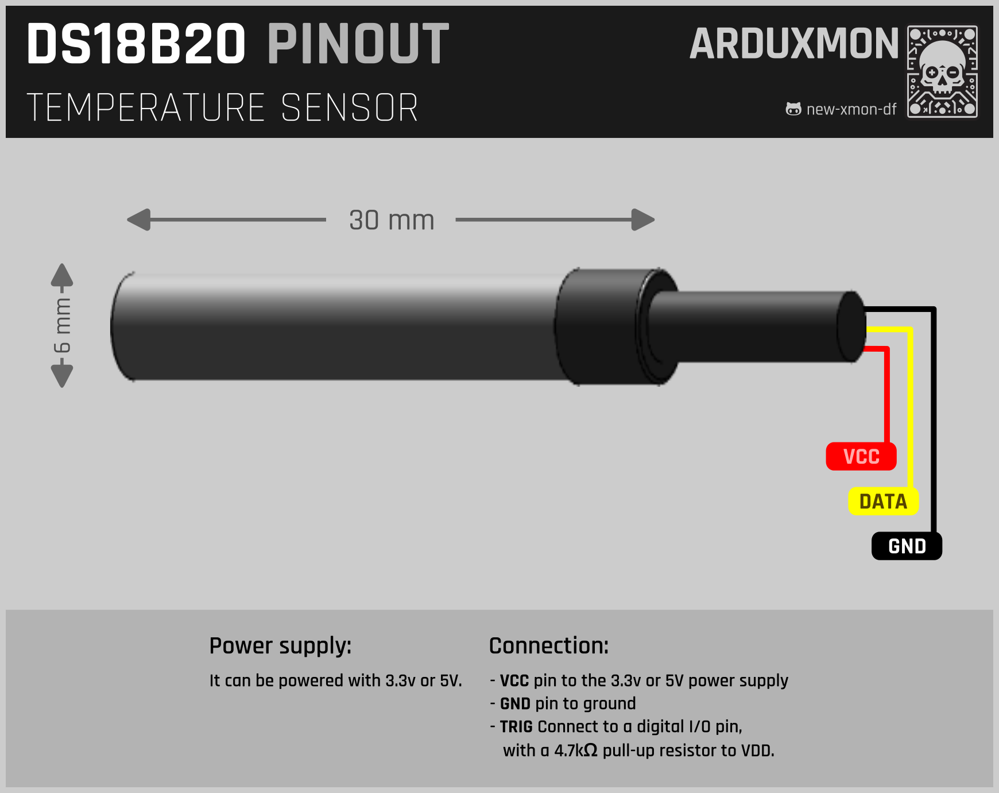

# DS18B20 Temperature Sensor

[](pictures/DS18B20.jpg)

## Description

The DS18B20 is a digital temperature sensor that provides 9-bit to 12-bit Celsius temperature measurements. It communicates via a 1-Wire bus, requiring only one data line (and ground) for communication with a microcontroller. This sensor is ideal for applications requiring accurate temperature measurements in a compact form factor.

## Features

- **Wide Operating Temperature Range**: -55°C to +125°C (-67°F to +257°F)
- **High Accuracy**: ±0.5°C accuracy from -10°C to +85°C
- **Digital Output**: No need for analog-to-digital conversion
- **Unique 1-Wire Interface**: Allows multiple sensors to be connected to the same data line
- **Low Power Consumption**: Powered directly from the data line ("parasitic power") or an external power supply
- **Compact Package**: Available in TO-92 and waterproof probe formats

## Technical Specifications

- **Operating Voltage**: 3.0V to 5.5V
- **Temperature Range**: -55°C to +125°C
- **Accuracy**: ±0.5°C from -10°C to +85°C
- **Resolution**: 9-bit to 12-bit user-selectable
- **Interface**: 1-Wire protocol
- **Package**: TO-92, waterproof probe

## How it Works

The DS18B20 sensor measures temperature and converts it to a digital signal using an internal analog-to-digital converter (ADC). It communicates the temperature data via the 1-Wire protocol, which allows multiple devices to share the same data line. Each sensor has a unique 64-bit serial code, ensuring that each sensor can be individually addressed on the same bus.

## Usage Instructions

### Wiring

- **VDD**: Connect to 3.3V or 5V power supply
- **GND**: Connect to ground
- **DQ (Data)**: Connect to a digital I/O pin on the microcontroller, with a 4.7kΩ pull-up resistor to VDD

### Parasitic Power Mode

For parasitic power mode, connect the VDD pin to ground. The sensor will draw power from the data line.

## ESPHome Configuration

The DS18B20 sensor can be easily integrated into Home Assistant using ESPHome. Below is a sample configuration for ESPHome.

```yaml

[...]

dallas:
  - pin: GPIO4

sensor:
  - platform: dallas
    address: 0x123456789ABCDEF
    name: "Living Room Temperature"
    
[...]
```

### Explanation

- **dallas**: Defines the Dallas (1-Wire) bus and the GPIO pin used.
- **sensor**: Configures the DS18B20 sensor with its unique address and assigns a name for Home Assistant integration.

## Finding Sensor Addresses

To find the unique addresses of your DS18B20 sensors, you can upload a simple sketch to your ESP device that prints the addresses to the logs. Here’s an example configuration for ESPHome:


```yaml
dallas:
  - pin: GPIO4

sensor:
  - platform: dallas
    address: 0xADDRESS
    name: "Temperature Sensor"
```

Check the logs after uploading to see the detected addresses.

## Pinout

[](schemas/DS18B20-Pinout.png)

## Documentation Links

- [Datasheet](pdf/DS18B20-datasheet.pdf)