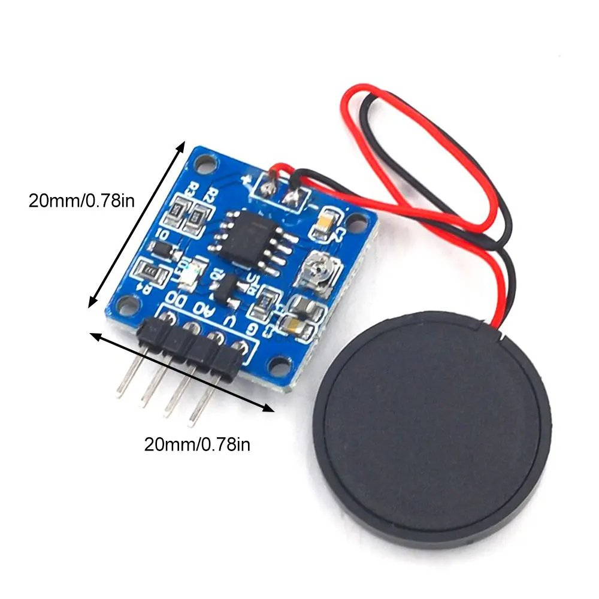
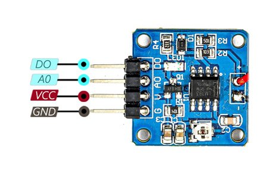

# Piezoelectric Vibration & Knock Sensor Module

The Piezoelectric Vibration & Knock Sensor Module offers versatility in detecting vibrations and knocks, making it suitable for various applications requiring motion detection. With both analog and digital output signals and sensitivity adjustment options, it provides flexibility for integration into projects.

## Description
The Piezoelectric Vibration & Knock Sensor Module utilizes a piezoelectric element to detect vibrations, sound waves, or mechanical strain. When subjected to physical deformation, it generates a voltage, enabling it to detect knocks on surfaces such as doors, tables, or other solid objects.

## Specifications
- **Operating Voltage:** (3.3~5)V
- **Operating Current:** < 1mA
- **Sensing Type:** Piezoelectric Element
- **Output Signal:** Analog and Digital
- **Output Indicator LED:** Yes
- **Sensitivity Adjustment:** On-board Potentiometer
- **Working Temperature Range:** -10℃ to +70℃

## Pinout

- **VCC:** Module power supply – 3.3V to 5V
- **GND:** Ground
- **D0:** Digital Output
- **A0:** Analog Output

## Documentation Links

- [Datasheet](pdf/SSR1072-Piezo-Vibration-Sensor-datasheet.pdf)
