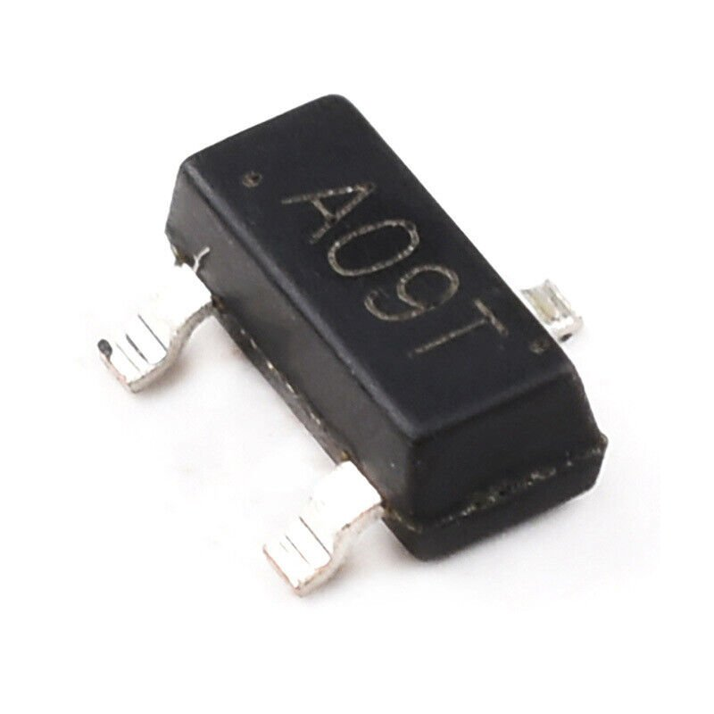
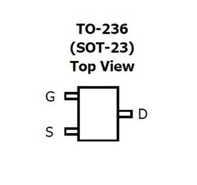

# AO3400A N-Channel MOSFET

[](pictures/AO3400A.jpg)

## Description

The AO3400A is an N-Channel MOSFET designed for low voltage and high-speed switching applications. It offers excellent RDS(on) performance and is housed in a compact SOT-23 package, making it ideal for use in portable and space-constrained devices.

## Features

- **Low On-Resistance**: RDS(on) < 0.045Ω at VGS = 4.5V
- **High-Speed Switching**: Fast switching times, suitable for high-frequency circuits
- **Low Gate Charge**: Minimal drive requirements, improving efficiency
- **Compact Package**: Available in SOT-23, saving board space
- **Thermal Performance**: Efficient thermal management for reliable operation

## Technical Specifications

- **Drain-Source Voltage (VDS)**: 30V
- **Gate-Source Voltage (VGS)**: ±20V
- **Continuous Drain Current (ID)**: 5.8A at 25°C
- **Pulsed Drain Current (ID)**: 20A
- **On-Resistance (RDS(on))**: < 0.045Ω at VGS = 4.5V
- **Package**: SOT-23

## How it Works

The AO3400A operates as a switch that is activated by applying a voltage to the gate terminal. When a sufficient gate-to-source voltage (VGS) is applied, it creates a conductive channel between the drain and source, allowing current to flow. The MOSFET's low on-resistance (RDS(on)) ensures efficient current conduction with minimal power loss, making it suitable for power management applications.

## Usage Instructions

### Wiring

- **Drain (D)**: Connect to the load
- **Source (S)**: Connect to ground
- **Gate (G)**: Connect to the microcontroller or control circuit with appropriate gate drive voltage

### Gate Drive Considerations

Ensure that the gate voltage (VGS) is within the recommended range for proper operation. A higher VGS improves the on-state performance by reducing RDS(on).

## ESPHome Configuration

The AO3400A can be used in various switching applications and controlled via ESPHome. Below is a sample configuration for ESPHome to use the AO3400A as a switch.

```yaml
# ...

switch:
  - platform: gpio
    pin: GPIOXX
    name: "MOSFET Switch"
    
# ...
```
### Explanation
- switch: Configures a GPIO pin to control the AO3400A MOSFET.
- pin: Specifies the GPIO pin connected to the gate of the MOSFET.
- name: Assigns a name for Home Assistant integration.
    
## Pinout

[](pictures/AO3400A-pinout.png)

## Documentation Links

- [Datasheet](pdf/AO3400A-datasheet.pdf)