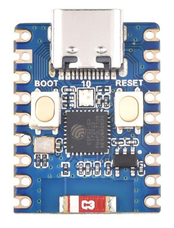

# Comparative Table of Development Boards

| Picture                                                                                                              | Board                                                          | Processor     | Flash   | RAM        | Performance        | GPIOs | I/O | Power Pins (5V, 3V3, GND) | Dimensions (mm) | Specific Features                                                  |
|----------------------------------------------------------------------------------------------------------------------|----------------------------------------------------------------|---------------|---------|------------|--------------------|-------|-----|---------------------------|-----------------|--------------------------------------------------------------------|
|  | [ESP32-C3 Supermini](../Boards/ESP32_C3_SUPERMINI/README.md)   | ESP32-C3      | 4MB     | 400KB SRAM | 160 MHz, WiFi, BLE | 11    | 11  | 1x 5V, 1x 3V3, 2x GND     | 24.13 x 18.00   | USB-C, GPIO, low power consumption                                 |
|                   | [ESP32-C3 ZERO](../Boards/ESP32_C3_ZERO/README.md)             | ESP32-C3      | 4MB     | 400KB SRAM | 160 MHz, WiFi, BLE | 11    | 11  | 1x 5V, 1x 3V3, 2x GND     | 52.0 x 18.0     | USB-C, GPIO, low power consumption                                 |
|  | [ESP32-DevKitC 38](../Boards/ESP32-DEVKIT-38PINS/README.md)    | ESP32-D0WDQ6  | 4MB/8MB | 520KB SRAM | 240 MHz, WiFi, BLE | 34    | 34  | 1x 5V, 1x 3V3, 3x GND     | 50.0 x 25.4     | USB Micro-B, GPIO, multiple interfaces (SPI, I2C, UART)            |
|                     | [LOLIN32 Lite](../Boards/LOLIN32_Lite/README.md)               | ESP32-D0WD    | 4MB     | 520KB SRAM | 240 MHz, WiFi, BLE | 26    | 26  | 1x 5V, 1x 3V3, 2x GND     | 50.0 x 25.0     | USB-C, LiPo battery, Grove connector                               |
|           | [WEMOS D1 MINI v4](../Boards/WEMOS_D1_MINI/README.md)          | ESP8266EX     | 4MB     | 96KB SRAM  | 160 MHz, WiFi      | 11    | 11  | 1x 5V, 1x 3V3, 2x GND     | 34.2 x 25.6     | USB Micro-B  \| USB-C, compatible with WEMOS shields               |
|     | [WEMOS D1 MINI ESP32](../Boards/WEMOS_D1_MINI_ESP32/README.md) | ESP32-D0WD    | 4MB     | 520KB SRAM | 240 MHz, WiFi, BLE | 34    | 34  | 1x 5V, 1x 3V3, 3x GND     | 34.2 x 25.6     | USB Micro-B  \| USB-C, 34 GPIO pins, compatible with WEMOS shields |
|              | [WEMOS S2 MINI](../Boards/WEMOS_S2_MINI/README.md)             | ESP32-S2FN4R2 | 4MB     | 320KB SRAM | 240 MHz, WiFi      | 27    | 27  | 1x 5V, 1x 3V3, 2x GND     | 46.0 x 25.0     | USB-C, GPIO, multiple interfaces (SPI, I2C, UART)                  |
|           | [WEMOS D1 UNO R3](../Boards/WEMOS_D1_UNO_R3/README.md)         | ESP8266EX     | 4MB     | 96KB SRAM  | 160 MHz, WiFi      | 11    | 11  | 1x 5V, 1x 3V3, 2x GND     | 68.6 x 53.4     | Compatible with Arduino UNO shields, USB Micro-B  \| USB-C         |

## Feature Ranking

#### Processor (performance and capabilities)

1. ESP32-DevKitC 38 (240 MHz, WiFi, BLE, more interfaces)
2. LOLIN32 Lite (240 MHz, WiFi, BLE)
3. WEMOS D1 MINI ESP32 (240 MHz, WiFi, BLE)
4. WEMOS S2 MINI (240 MHz, WiFi)
5. ESP32-C3 Supermini (160 MHz, WiFi, BLE)
6. ESP32-C3 ZERO (160 MHz, WiFi, BLE)
7. WEMOS D1 MINI v4 (160 MHz, WiFi)
8. WEMOS D1 UNO R3 (160 MHz, WiFi)

#### Memory (Flash and SRAM)

1. ESP32-DevKitC 38 (4MB/8MB Flash, 520KB SRAM)
2. LOLIN32 Lite (4MB Flash, 520KB SRAM)
3. WEMOS D1 MINI ESP32 (4MB Flash, 520KB SRAM)
4. WEMOS S2 MINI (4MB Flash, 320KB SRAM)
5. ESP32-C3 Supermini (4MB Flash, 400KB SRAM)
6. ESP32-C3 ZERO (4MB Flash, 400KB SRAM)
7. WEMOS D1 MINI v4 (4MB Flash, 96KB SRAM)
8. WEMOS D1 UNO R3 (4MB Flash, 96KB SRAM)

#### Number of GPIOs

1. ESP32-DevKitC 38 - 34 GPIOs
2. WEMOS D1 MINI ESP32 - 34 GPIOs
3. WEMOS S2 MINI - 27 GPIOs
4. LOLIN32 Lite - 26 GPIOs
5. ESP32-C3 Supermini - 11 GPIOs
6. ESP32-C3 ZERO - 11 GPIOs
7. WEMOS D1 MINI v4 - 11 GPIOs
8. WEMOS D1 UNO R3 - 11 GPIOs

#### Number of I/O Pins

1. ESP32-DevKitC 38 - 34 I/O
2. WEMOS D1 MINI ESP32 - 34 I/O
3. WEMOS S2 MINI - 27 I/O
4. LOLIN32 Lite - 26 I/O
5. ESP32-C3 Supermini - 11 I/O
6. ESP32-C3 ZERO - 11 I/O
7. WEMOS D1 MINI v4 - 11 I/O
8. WEMOS D1 UNO R3 - 11 I/O

#### Number of Power Pins (5V, 3V3, GND)

1. ESP32-DevKitC 38 - 5 Pins (1x 5V, 1x 3V3, 3x GND)
2. WEMOS D1 MINI ESP32 - 5 Pins (1x 5V, 1x 3V3, 3x GND)
3. LOLIN32 Lite - 4 Pins (1x 5V, 1x 3V3, 2x GND)
4. ESP32-C3 Supermini - 4 Pins (1x 5V, 1x 3V3, 2x GND)
5. ESP32-C3 ZERO - 4 Pins (1x 5V, 1x 3V3, 2x GND)
6. WEMOS D1 MINI v4 - 4 Pins (1x 5V, 1x 3V3, 2x GND)
7. WEMOS S2 MINI - 4 Pins (1x 5V, 1x 3V3, 2x GND)
8. WEMOS D1 UNO R3 - 4 Pins (1x 5V, 1x 3V3, 2x GND)

#### Dimensions (smaller is better for compact projects)

1. ESP32-C3 Supermini (24.13 x 18.00 mm)
2. WEMOS D1 MINI v4 (34.2 x 25.6 mm)
3. WEMOS D1 MINI ESP32 (34.2 x 25.6 mm)
4. WEMOS S2 MINI (46.0 x 25.0 mm)
5. LOLIN32 Lite (50.0 x 25.0 mm)
6. ESP32-DevKitC 38 (50.0 x 25.4 mm)
7. ESP32-C3 ZERO (52.0 x 18.0 mm)
8. WEMOS D1 UNO R3 (68.6 x 53.4 mm)

#### Specific Features

1. ESP32-DevKitC 38 (versatility in interfaces, multiple memory options)
2. LOLIN32 Lite (integrated LiPo battery, Grove connector)
3. WEMOS D1 MINI ESP32 (compatibility with WEMOS shields, powerful ESP32)
4. WEMOS S2 MINI (240 MHz, multiple interfaces)
5. ESP32-C3 Supermini (USB-C, low power)
6. ESP32-C3 ZERO (USB-C, low power)
7. WEMOS D1 MINI v4 (compatibility with WEMOS shields)
8. WEMOS D1 UNO R3 (compatibility with Arduino UNO shields)

## Conclusions

- **Best Overall Performance:** ESP32-DevKitC 38, LOLIN32 Lite, and WEMOS D1 MINI ESP32.
- **Best for Compact Projects:** ESP32-C3 Supermini.
- **Best Shield Compatibility:** WEMOS D1 UNO R3 (for Arduino UNO shields) and WEMOS D1 MINI v4 (for WEMOS shields).

[Back to home](../README.md)