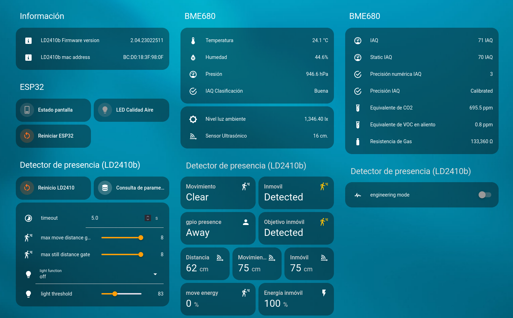

# Living Room Control System 🏠🕹️

Welcome to the Living Room Control System project! This project aims to enhance the automation and control capabilities of your living room using various sensors and a Wemos S2 Mini microcontroller (ESP32), integrated with Home Assistant.

## Description
The Living Room Control System focuses on creating a centralized control hub for your living room environment. By utilizing ESPHome for firmware development and integrating with Home Assistant, this project enables you to monitor and control various aspects of your living room, such as lighting, temperature, and more.

## Components
- [**Wemos S2 Mini (ESP32)**](../../Boards/WEMOS_S2_MINI/README.md) - [buy](https://www.aliexpress.com/item/1005006322374373.html)
- [**LD2410b**](../../Components/Sensors/Presence/LD2410b/README.md) - [buy](https://www.aliexpress.com/item/1005006200434556.html)
- [**BME680**](../../Components/Sensors/Environmental/BME680/README.md) - [buy](https://www.aliexpress.com/item/1005006160619365.html)
- [**HC-SR04**](../../Components/Sensors/Distance/HC-SR04/README.md) - [buy](https://www.aliexpress.com/item/1005006061377929.html)
- [**SH1106**](../../Components/Displays/SH1106/README.md) - [buy](https://www.aliexpress.com/item/1005005967766159.html)
- [**LDR 5528**](../../Components/Sensors/Light/LDR_5528/README.md) - [buy](https://www.aliexpress.com/item/880873842.html)
- **RGB LED (Common Cathode)**
- **Resistor 10k**
- **3x Resistor 220Ω**

## Files Included
- [`living_room_control.yaml`](firmware/living_room_sensors.yaml): ESPHome firmware configuration file.
- [`home_assistant_dashboard.yaml`](home_assistant/home_assistant_dashboard.yaml): Home Assistant configuration file for dashboard setup.
- [`schematic.pdf`](hardware/schematic.pdf): Electrical schematic diagram
- [`LICENSE`](LICENSE): Creative Commons Attribution-ShareAlike 4.0 International License

## Installation
1. Flash the ESPHome firmware onto the Wemos S2 Mini using the provided configuration file.
2. Set up the Home Assistant dashboard using the provided configuration file.
3. Assemble the hardware according to the schematic.

## Usage
- Monitor and control various aspects of your living room environment, such as temperature, lighting, and more.
- Create automation rules in Home Assistant to automate tasks and routines in your living room.

## Screenshots

### Home Assistant Dashboard

In this screenshot, you can see the Home Assistant dashboard configured for the project. It provides an intuitive interface for monitoring and controlling the plant irrigation system from any network-connected device. Explore the different options and functionalities to customize your experience! 🌿💻

## Dependencies
Additionally, the provided `home_assistant_dashboard.yaml` file in this repository is configured using Mushroom cards. Be sure to have Mushroom installed in your Home Assistant to properly render the dashboard layout.

### Mushroom - Dependency for Dashboard Layout
[Mushroom](https://github.com/piitaya/lovelace-mushroom/) is a collection of cards for Home Assistant Dashboard UI, serving as a dependency for the dashboard layout in this project. Mushroom's mission is to propose easy-to-use components to build your Home Assistant dashboard.

**Note:** To use Mushroom in your Home Assistant configuration, make sure you have [HACS](https://hacs.xyz/) installed. Mushroom cards can be easily added to your Lovelace dashboard using HACS.

## License
This project is licensed under the [Creative Commons Attribution-ShareAlike 4.0 International License](LICENSE).

Feel free to contribute, modify, and share!

---

Feel free to customize this template further to fit the specifics of your project. Let me know if you need any additional information or assistance!
