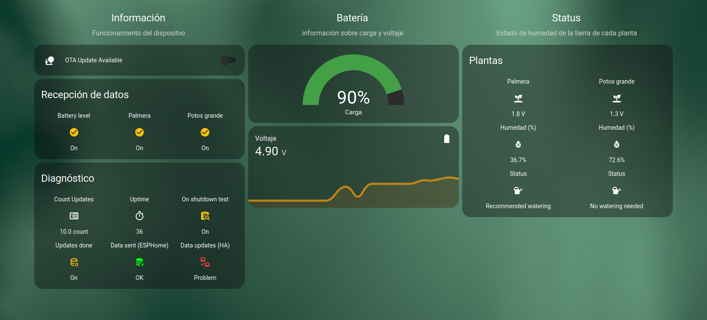
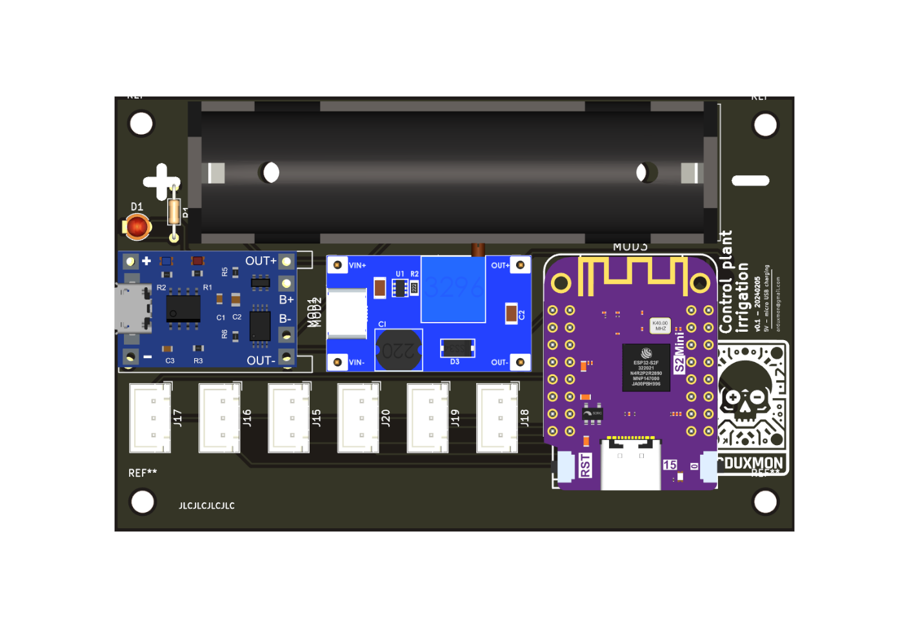
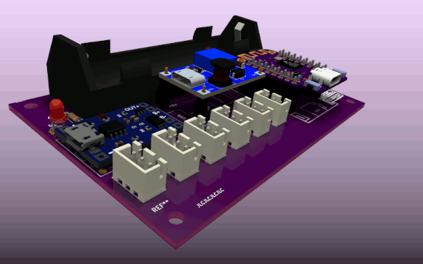

# Plant Irrigation Control 🌱💧

Welcome to the Plant Irrigation Control project! This project aims to control the soil moisture of multiple plants using various soil moisture sensors, a Wemos S2 Mini (ESP32), a 18650 battery, a TP4046 charger, and an MT3608 voltage booster.

## Description
This project utilizes ESPHome for firmware development and integrates with Home Assistant for dashboard visualization and control. It includes the schematic, PCB design, and Gerber files for easy reproduction and assembly.

## Components
- [Wemos S2 Mini (ESP32-S2)](../../Boards/WEMOS_S2_MINI/README.md) - [buy](https://www.aliexpress.com/item/1005006157693055.html)
- [Soil Moisture Sensors (multiple)](../../Components/Sensors/Soil%20Moisture/Capacitive%20Soil%20Moisture) - [buy](https://www.aliexpress.com/item/1005005261267226.html)
- [TP4046 Charger]() - [buy](https://www.aliexpress.com/item/1005006365875594.html)
- [MT3608 Voltage Booster]() - [buy](https://www.aliexpress.com/item/1005006365807934.html)
- 18650 Battery
- LED
- Resistor 220Ω
- As many **JST 1x03 P2.50mm Vertical connectors** as the number of plants you want to control (the board supports a maximum of 6).

## Files Included
- [`plant_irrigation_control.yaml`](firmware/plant_irrigation_control.yaml): ESPHome firmware configuration file.
    - [`device_base_lolins2mini.yaml`](firmware/common/device_base_lolins2mini.yaml)
    - [`riego_common.yaml`](firmware/common/riego_common.yaml)
    - [`riego_esphome.yaml`](firmware/common/riego_esphome.yaml)
    - [`wifi_test.yaml`](firmware/common/wifi_test.yaml)
- [`home_assistant_dashboard.yaml`](home_assistant/home_assistant_dashboard.yaml): Home Assistant configuration file for dashboard setup.
    - [`plant_irrigation_control.yaml`](home_assistant/xmon_packages/plant_irrigation_control.yaml): Configuration file containing custom settings for ESPHome devices in Home Assistant.
- [`schematic.pdf`](hardware/schematic.pdf): Electrical schematic diagram
- `pcb_design.pcb`: PCB design file
- `gerber_files.zip`: Gerber files for PCB fabrication
- [`LICENSE`](LICENSE): Creative Commons Attribution-ShareAlike 4.0 International License

## Installation
1. Flash the ESPHome firmware onto the Wemos S2 Mini using the provided configuration file.
2. Set up the Home Assistant dashboard using the provided configuration file.
3. Assemble the hardware according to the schematic and PCB design.

## Usage
- Monitor soil moisture levels and control irrigation remotely through the Home Assistant dashboard.

## Screenshots

### Home Assistant Dashboard

In this screenshot, you can see the Home Assistant dashboard configured for the project. It provides an intuitive interface for monitoring and controlling the plant irrigation system from any network-connected device. Explore the different options and functionalities to customize your experience! 🌿💻

[](screenshots/dashboard_ha.png)

### PCB front

Here's a top view of my printed circuit board (PCB). This image provides a clear view of the layout of components on the board. It's essential for understanding the physical arrangement of the circuit. If you have any questions or need further details, feel free to ask!

[](screenshots/PCB-front.png)

### PCB 3D

Here's a 3D representation of my printed circuit board (PCB). In this image, you can observe the arrangement of the components and the three-dimensional structure of the board. It's useful for visualizing how the final product will look once assembled. I hope you find it helpful. If you need anything else, I'm here for you!

[](screenshots/PCB-3D.gif)

## Dependencies

Additionally, the provided `home_assistant_dashboard.yaml` file in this repository is configured using Mushroom cards. Be sure to have Mushroom installed in your Home Assistant to properly render the dashboard layout.

### Mushroom - Dependency for Dashboard Layout
[Mushroom](https://github.com/piitaya/lovelace-mushroom/) is a collection of cards for Home Assistant Dashboard UI, serving as a dependency for the dashboard layout in this project. Mushroom's mission is to propose easy-to-use components to build your Home Assistant dashboard.

**Note:** To use Mushroom in your Home Assistant configuration, make sure you have [HACS](https://hacs.xyz/) installed. Mushroom cards can be easily added to your Lovelace dashboard using HACS.

### ESPHome Configuration (Dependencies)

These lines include necessary configuration for:
- OTA updates in ESPHome, allowing for seamless firmware updates of your ESP devices.
- Check data received by Home Assistant,

Make sure to add them appropriately to your `configuration.yaml` file.

```yaml
homeassistant:
  # Files where I include various custom configurations for my ESPHome devices.
  packages: !include_dir_merge_named xmon_packages
```

**Note:** To load the necessary configurations, I'm using [Home Assistant Packages](https://www.home-assistant.io/docs/configuration/packages/).

## License
This project is licensed under the [Creative Commons Attribution-ShareAlike 4.0 International License](LICENSE).

Feel free to contribute, modify, and share!

